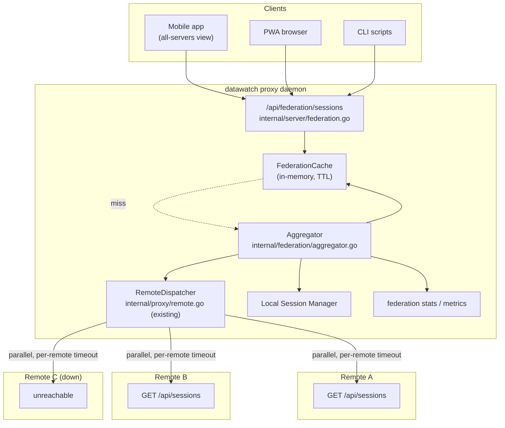

# F19: Federation Fan-Out Sessions API

**Date:** 2026-04-18
**Version at planning:** v2.4.5
**Priority:** medium (mobile MVP "nice-to-have"; safe to land after MVP)
**Effort:** 2-3 days
**Category:** api / proxy / federation
**Source:** [GitHub issue #3](https://github.com/dmz006/datawatch/issues/3) — request from `dmz006/datawatch-app` mobile client
**Cross-reference:** `datawatch-app docs/api-parity.md` row "all-servers fan-out"

---

## Problem

The mobile app exposes an "all-servers view" that today queries every configured server
profile in parallel from the client. For users with a proxy primary plus many proxied
children, that explodes the request count and burns mobile battery.

datawatch already has the building block: `RemoteDispatcher.ListAllSessions()` in
`internal/proxy/remote.go` returns `map[server]→[]Session` for every configured remote.
What's missing is a clean, single, bearer-authenticated REST endpoint that returns:

- the proxy's own (`primary`) sessions,
- the proxied children's (`proxied[server]`) sessions,
- a clear `errors[server]` map for any reachability problems,

so the mobile app makes one call instead of N.

---

## Goals

1. Single round-trip aggregation endpoint with deterministic envelope (primary / proxied / errors).
2. Server-side parallelism, per-remote timeout, partial-success semantics (one slow remote
   never blocks the others).
3. Filterable by `since`, `states`, `include`.
4. Cached briefly (configurable TTL) for cheap mobile polling.
5. Configurable everywhere (no hard-coded values).
6. Observable: per-remote latency, success/error counters, cache hit rate.
7. Backward compatible: existing per-remote endpoints (`/api/proxy/{server}/...`) and the
   existing `/api/sessions/aggregated` keep working unchanged.

---

## Non-goals

- WebSocket fan-out (separate plan; clients can keep using `/api/proxy/{server}/ws` for
  live updates per remote).
- Cross-remote command dispatch (already covered by the router's remote dispatcher path).
- Auth federation across remotes (each remote keeps its own token; the proxy stores them
  per-remote in `proxy.remotes[]` today; this plan does not change that model).

---

## API surface

```
GET /api/federation/sessions
Authorization: Bearer <token>

Query (all optional):
  since=<unix_ms>            only return sessions with activity newer than ts
  include=primary,proxied    default = both. csv. set to "proxied" to exclude primary.
  states=running,waiting     filter set; default = all
  servers=alpha,bravo        only fan out to these named remotes; default = all enabled
  timeout_ms=2000            per-remote timeout; capped at federation.max_timeout_ms
  fresh=true                 bypass cache for this call

→ 200
{
  "primary":   [ <Session>, ... ],
  "proxied":   {
    "alpha":   [ <Session>, ... ],
    "bravo":   [ <Session>, ... ]
  },
  "errors":    {
    "charlie": { "code": "timeout",      "detail": "no response in 2000ms", "elapsed_ms": 2000 },
    "delta":   { "code": "auth_failed",  "detail": "401 from /api/sessions" }
  },
  "cached":     true,
  "cached_age_ms": 837,
  "fetched_at":    "2026-04-18T12:34:56Z"
}
```

### Error codes

Stable: `timeout`, `connect_failed`, `auth_failed`, `tls_failed`, `decode_failed`,
`disabled`, `unknown_server`, `internal`. Mobile branches on these.

### Companion endpoints (small, free)

```
GET /api/federation/servers          # list of configured remotes + reachability snapshot
GET /api/federation/stats            # aggregation counters / cache stats
```

---

## Architecture



### Cache semantics

- Single in-memory cache keyed by canonicalised query (`since`, `include`, `states`,
  `servers` — sorted).
- TTL = `federation.cache_ttl_ms` (default 1500 ms; rationale: typical mobile poll
  interval, low enough to feel live).
- `fresh=true` bypasses but still **populates** the cache for next caller.
- Cache evicted on any of: TTL expiry, config reload, remote add/remove, or when a remote
  fires a state-change webhook back to the proxy (future hook — out of scope here).

### Parallel fan-out

- One goroutine per included remote. `errgroup.WithContext` for cancellation.
- Per-remote timeout = min(`query.timeout_ms`, `federation.max_timeout_ms`,
  `remote.timeout_ms`).
- Partial-success: a remote's error never aborts siblings; it lands in `errors[server]`.

### Reuse vs new code

- **Reuse:** `RemoteDispatcher.ListAllSessions` (extend with per-remote ctx + structured
  error), local `Manager.ListSessions`, bearer auth middleware, existing remotes config
  in `internal/config/config.go`.
- **New:** `internal/federation` package containing the aggregator, the cache, and the
  query canonicaliser.

---

## Configuration (no hard-coded values, all five channels)

### New config block

```yaml
federation:
  enabled: true                      # master switch; off = endpoint returns 404
  cache_ttl_ms: 1500
  max_timeout_ms: 5000               # caps per-call timeout_ms
  default_timeout_ms: 2000
  max_parallel: 16                   # per-call goroutine cap
  default_include: ["primary","proxied"]
  default_states: []                 # empty = no filter
  servers_allowlist: []              # if non-empty, restrict the `servers` query to this set
```

### Access methods

| Method | How |
|--------|-----|
| **YAML** | `~/.datawatch/config.yaml` → `federation:` block |
| **CLI** | `datawatch config set federation.cache_ttl_ms 2000`; `datawatch federation list` (one-shot all-servers) |
| **Web UI** | Settings → General → **Federation** card (all keys); a new Monitor → **Federation** card showing per-remote latency + cache hit rate |
| **REST API** | `GET /api/federation/sessions`, `GET /api/federation/servers`, `GET /api/federation/stats`; `GET/PUT /api/config` for `federation.*` |
| **Comm channel** | `configure federation.cache_ttl_ms=2000`; `federation status`, `federation list` chat commands |
| **MCP** | `federation_list_sessions`, `federation_servers`, `federation_stats`, `federation_config_set` tools |

### Sensitive-field handling

- No new secrets introduced. Per-remote bearer tokens already live in
  `proxy.remotes[].token`; the federation handler never echoes them in responses.
- The `servers` query parameter is intersected with `servers_allowlist` (if set) before
  fan-out, preventing a bearer holder from probing arbitrary names.

---

## Implementation phases

### Phase 1 — aggregator + cache (0.5 day)

- New `internal/federation/aggregator.go` with `Aggregator.Fetch(ctx, query) (Result, error)`.
- New `internal/federation/cache.go` (TTL, canonical key).
- Extend `RemoteDispatcher.ListAllSessions` to accept per-call `ctx` and return
  `map[server]ServerResult{Sessions, Err, ElapsedMs}`.
- Unit tests: parallel paths, partial failure, cache hit/miss, query canonicalisation.

### Phase 2 — REST handlers (0.5 day)

- `internal/server/federation.go` — three handlers (`/sessions`, `/servers`, `/stats`).
- Route registration in `server.go`. Bearer middleware reuse.
- 404 when `federation.enabled = false`. 400 when `servers_allowlist` violated.
- Tests: 200 happy, 200 partial, 401, 400, 404 (disabled), `fresh=true`, `since` filter.

### Phase 3 — config wiring (0.25 day)

- `FederationConfig` struct + defaults in `internal/config/config.go`.
- `handleGetConfig` / `applyConfigPatch` entries.
- `docs/config-reference.yaml` entry.

### Phase 4 — observability (0.25 day) [AGENT.md monitoring rule]

- `SystemStats` extension: `FederationCalls`, `FederationCacheHits`,
  `FederationCacheMisses`, `FederationRemoteOK`, `FederationRemoteErr`,
  `FederationP95LatencyMs`, `FederationLastError` (per remote).
- Prometheus metrics: `datawatch_federation_calls_total{result}`,
  `datawatch_federation_remote_latency_ms{server}`,
  `datawatch_federation_cache_hit_total`,
  `datawatch_federation_cache_miss_total`.
- Web UI Monitor → **Federation** card.
- MCP tools: `federation_stats`, `federation_servers`, `federation_list_sessions`.
- Comm channel: `federation status`, `federation list`.

### Phase 5 — CLI + wizard (0.25 day)

- `datawatch federation list` subcommand (calls local API for parity).
- No new wizard step; surface in `datawatch setup proxy` wizard as a Y/N toggle.

### Phase 6 — docs + diagrams (0.25 day)

- New section in `docs/operations.md` "Federation API" + flow diagram.
- Update `docs/architecture.md` Proxy Mode section (add federation endpoint to diagram).
- Update `docs/architecture-overview.md`.
- README Documentation Index entry.
- `docs/api/openapi.yaml` (3 paths + 5 schemas: `FederationSessionsResponse`,
  `FederationServer`, `FederationError`, `FederationStats`, `FederationServersResponse`).
- `docs/testing-tracker.md` row.

### Phase 7 — testing (0.25 day)

| Test | Method | Expected |
|------|--------|----------|
| Bearer required | curl | 401 |
| Disabled flag | curl with `federation.enabled=false` | 404 |
| Happy 3-remote | 3 httptest remote daemons | 200 with all populated, `cached=false` |
| One slow remote | one httptest with `time.Sleep(3s)`, `timeout_ms=500` | 200 with that one in `errors`, others present, total elapsed < 1s |
| Auth failed | one remote returns 401 | `errors[name].code = "auth_failed"` |
| Cache hit | back-to-back identical query | second call `cached=true`, `cached_age_ms < ttl` |
| `fresh=true` | bypasses cache | `cached=false` even within TTL |
| `servers` filter | `servers=alpha` with allowlist `[alpha,bravo]` | only alpha fanned out |
| `servers` outside allowlist | `servers=charlie` | 400 |
| `since` filter | sessions older than ts | excluded |
| MCP `federation_list_sessions` | mcp test client | matches REST output |
| Comm channel `federation status` | `POST /api/test/message` | response shows counters |
| Web UI Monitor card | Chrome automation | renders per-remote latency live |
| Config round-trip | PUT → GET → comm `configure` | every `federation.*` field round-trips |

---

## Files to add / modify

| File | Change |
|------|--------|
| `internal/federation/aggregator.go` | new |
| `internal/federation/cache.go` | new |
| `internal/federation/aggregator_test.go` | new |
| `internal/federation/cache_test.go` | new |
| `internal/server/federation.go` | new HTTP handlers |
| `internal/server/api.go` | wire `federation.*` config |
| `internal/server/server.go` | route registration |
| `internal/proxy/remote.go` | extend `ListAllSessions` for per-call ctx + structured errors |
| `internal/config/config.go` | `FederationConfig` |
| `internal/router/router.go` | `federation status`, `federation list` commands |
| `internal/mcp/server.go` | federation tools |
| `internal/stats/collector.go` | counters |
| `internal/metrics/metrics.go` | Prometheus metrics |
| `internal/server/web/app.js` | Federation settings + monitor card |
| `internal/wizard/defs.go` | toggle in proxy wizard |
| `cmd/datawatch/main.go` | `federation list` subcommand |
| `docs/config-reference.yaml` | `federation:` block |
| `docs/operations.md` | Federation API section |
| `docs/architecture.md` | proxy diagram update |
| `docs/architecture-overview.md` | new top-level diagram |
| `docs/api/openapi.yaml` | 3 paths + 5 schemas |
| `docs/testing-tracker.md` | new row |
| `README.md` | Documentation Index entry |
| `CHANGELOG.md` | `[Unreleased]` entry |

---

## Risk assessment

| Risk | Impact | Mitigation |
|------|--------|------------|
| Slow remote stalls fan-out | Mobile UX | `errgroup` + per-remote timeout; partial result always returned within `max_timeout_ms` |
| Cache returns stale state to user clicking "refresh" | Confusion | `fresh=true` documented + a one-tap refresh in mobile UI bypasses TTL |
| Per-remote bearer leak in error message | Auth exposure | Errors strip headers; only short codes + safe details surfaced |
| `servers` query enumeration | Recon vector | `servers_allowlist` enforced; 400 on violation; not 404 (no info disclosure either way) |
| Cache memory growth | DoS | Cache bounded by query-key cardinality; canonicalisation drops high-cardinality combos by capping `since` precision to nearest second |
| Unbounded goroutines | DoS | `max_parallel` semaphore |

---

## Dependencies

- Existing `RemoteDispatcher.ListAllSessions` (extended, not replaced).
- Existing per-remote bearer token store in `proxy.remotes[]`.
- Optional: F17 device registry (used only for telemetry — `device_id` query param tag if
  the mobile app sends it; otherwise ignored).

---

## Status

- [ ] Phase 1 — aggregator + cache
- [ ] Phase 2 — REST handlers
- [ ] Phase 3 — config wiring
- [ ] Phase 4 — observability
- [ ] Phase 5 — CLI + wizard
- [ ] Phase 6 — docs + diagrams
- [ ] Phase 7 — testing

**Shipped in:** _(fill on completion)_
