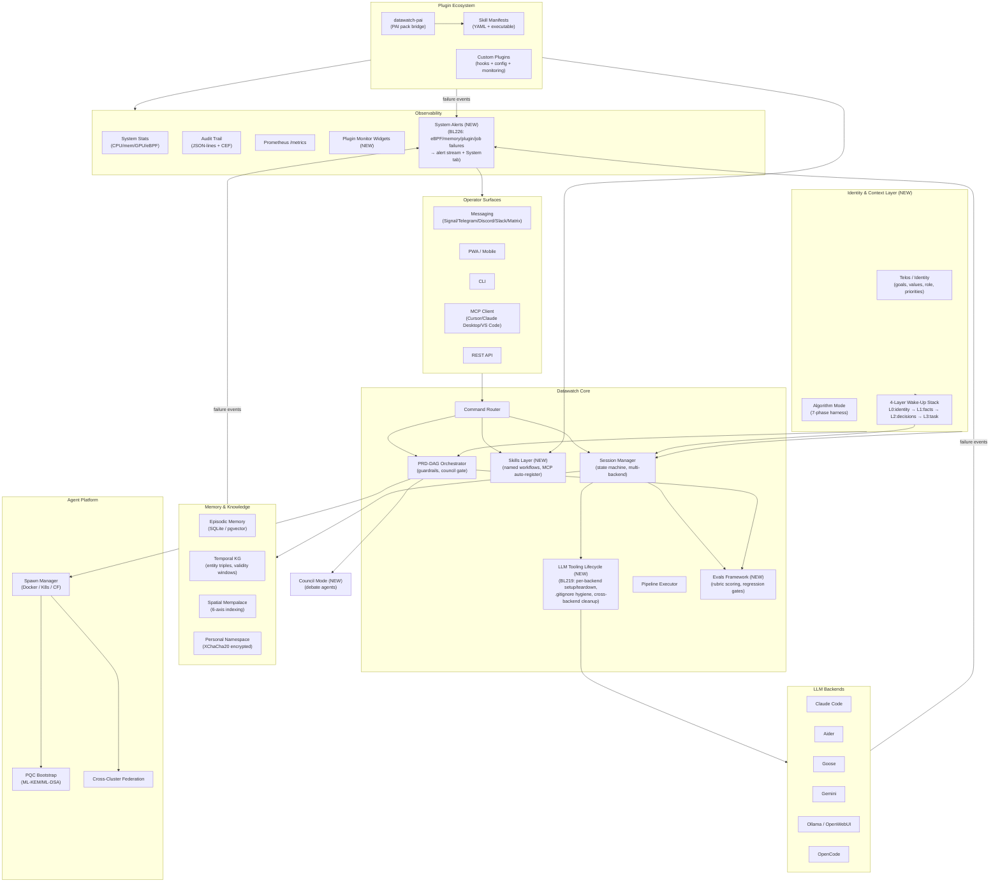
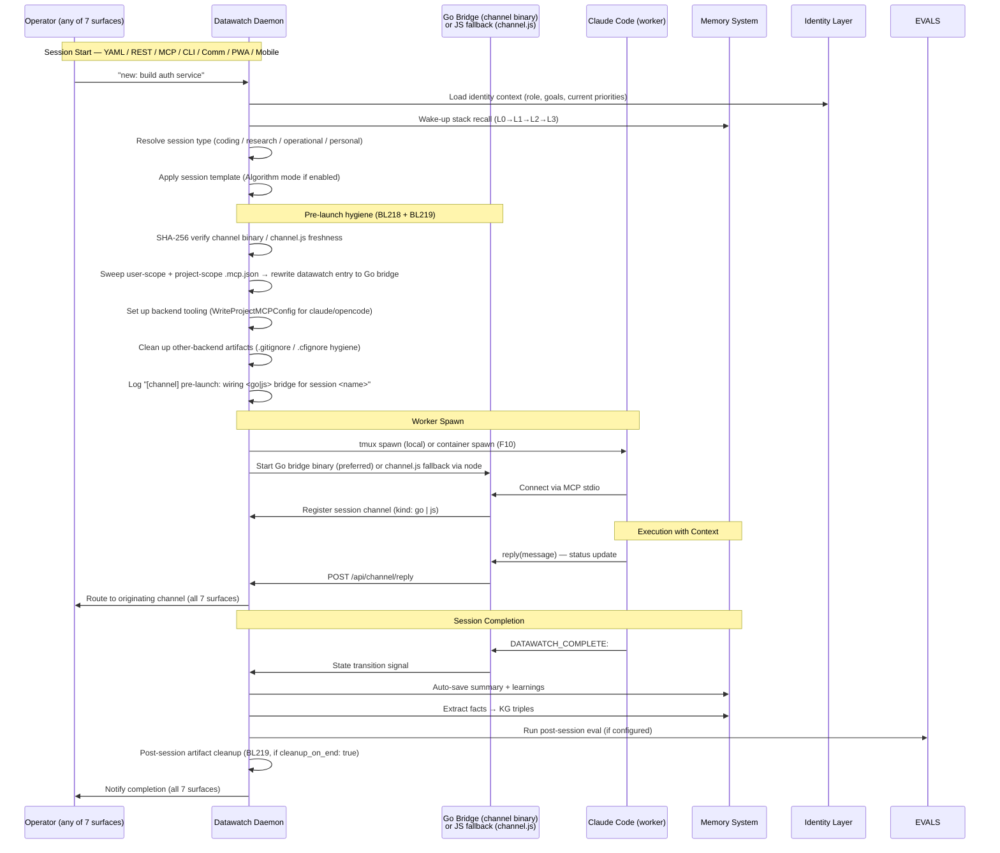
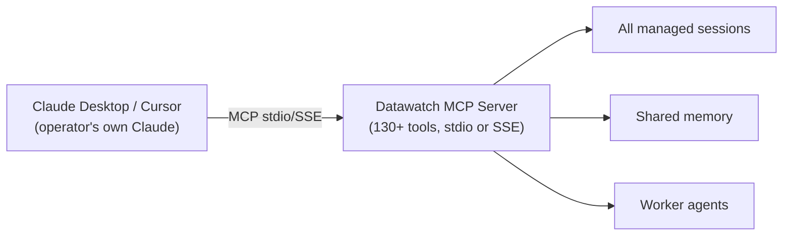
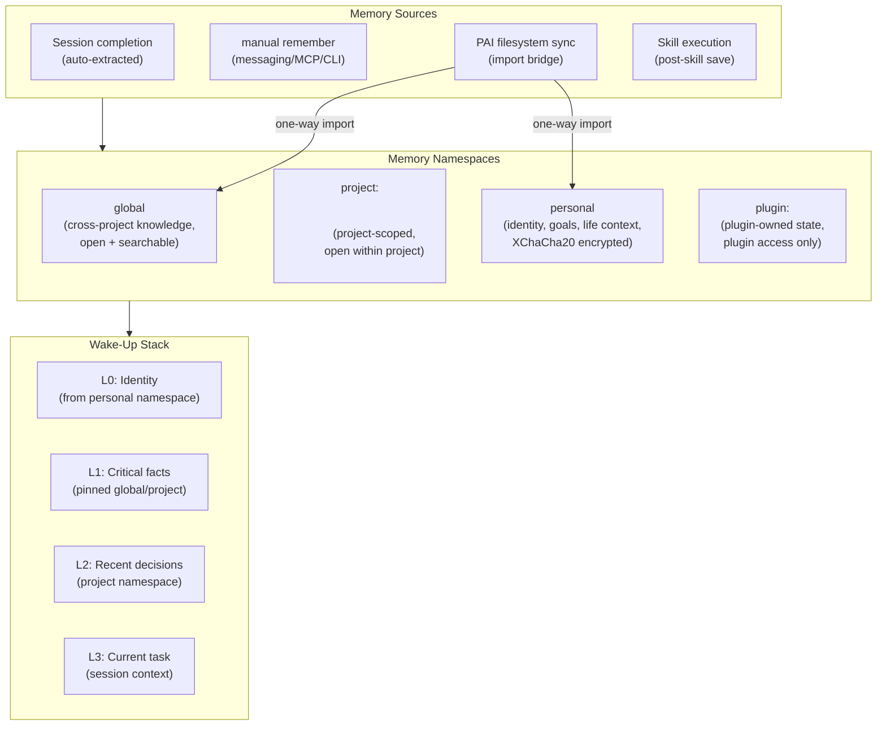
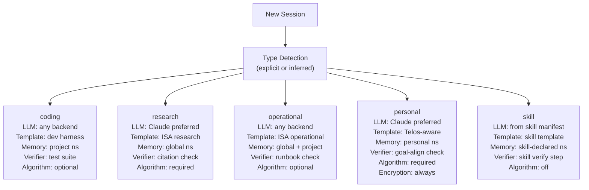
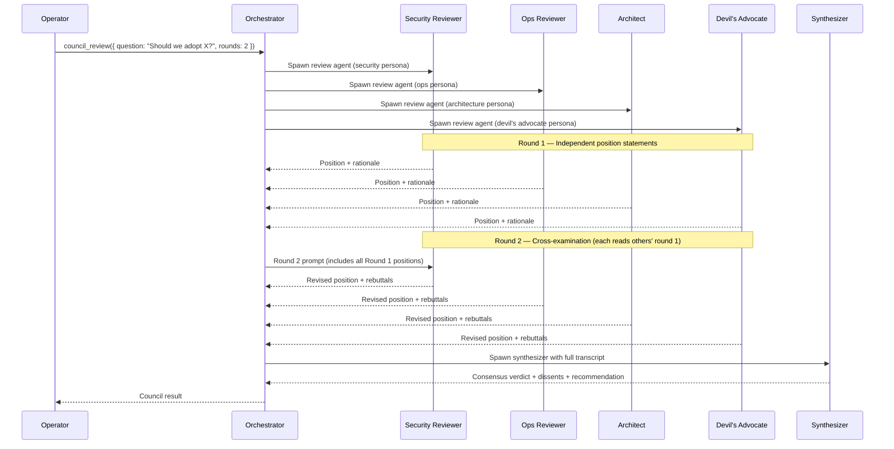

# Unified AI Management Platform — Design & Sprint Plan

**Scope:** Deep comparative analysis of PAI (danielmiessler/Personal_AI_Infrastructure) and datawatch,
architectural design for the converged platform, and a phased multi-week implementation roadmap.  
**Date:** 2026-05-02  
**Last updated:** 2026-05-02 — backlog items BL218–BL227 filed; pre-sprint Week 0 added; PRD rebuild track (BL221) added; open questions updated  
**Status:** Active — operator reviewed; BL218–BL221 formally filed in backlog; sprint begins at v6.0 release

---

## Part I — Intent Analysis

### What PAI Was Built To Do

PAI's root goal is to make Claude Code a **personal life operating system**. Every design decision traces back to that thesis:

- **Identity before task.** PAI starts with Telos — a structured operator identity document (principal identity, north-star goals, current projects, values). Before any work begins, the system knows *who* the operator is and *why* they are working. This context shapes every LLM interaction.
- **Deterministic workflows over free-form prompting.** PAI's Algorithm (7-phase: Observe → Orient → Decide → Act → Measure → Learn → Improve) is not a suggestion — it's a required harness around complex work. Skills are authored, installed, and verified as discrete units. The output of a skill is testable.
- **Personal before professional.** PAI tracks books, ideas, relationships, health, finances alongside engineering work. The AI is a life partner, not a coding assistant.
- **Filesystem as the data model.** Memory is markdown files. Skills are markdown + scripts. Config is `.env`. Nothing requires a database, network service, or daemon — PAI is fundamentally a single-user, local-first system that runs inside Claude Code's process.
- **Security through containment.** `.pai-protected.json` prevents any personal data from leaking into the public repository. The separation between "my private Kai instance" and "the public PAI repo" is architectural.
- **Extensibility through packs.** 45 public packs, each self-contained and independently installable. Anyone can author and publish a pack.

**PAI's constraint:** It is entirely parasitic on Claude Code. No PAI feature works without Claude Code running. There is no daemon, no API, no mobile client, no multi-machine support, no persistent state outside the filesystem. PAI is a skin on one tool.

---

### What Datawatch Was Built To Do — And Where It Went

Datawatch started as a **Signal bridge for Claude Code**: send a message from your phone, get back session output. That origin explains the early architecture — messaging backends, session lifecycle management, tmux, state machine.

But the scope expanded with every sprint:

| Sprint | What got added | Implicit claim |
|--------|---------------|----------------|
| S1–S3 | Multi-backend messaging, session routing | "Any channel → any LLM" |
| S4–S5 | Memory system, KG, spatial indexing | "AI with persistent context" |
| S6 (F10) | Container worker spawn, Kubernetes, post-quantum TLS | "Distributed AI infrastructure" |
| S7 (BL33) | Plugin framework | "Extensible platform" |
| S8 (BL117) | PRD-DAG orchestrator with guardrails | "Autonomous AI project manager" |
| v5.x | PWA, mobile companion, i18n, eBPF, federation | "Production control plane" |

**The implicit claim that was never named:** Datawatch became a **distributed AI session management platform** — a control plane that sits above any LLM backend and provides identity, memory, routing, execution, observability, and extensibility. Claude Code is one backend among eight. Signal is one channel among twelve.

**The gap PAI reveals:** Datawatch manages AI sessions as infrastructure but has no concept of the *person using it*. There is no identity layer, no goal alignment, no structured thinking harness, no skill taxonomy. Sessions start with a blank slate. The system is powerful but impersonal.

---

### The Convergence Thesis

PAI and datawatch are complementary halves of the same system:

```
PAI:        Identity + Goals + Skills + Algorithm + Local Context
            ─────────────────────────────────────────────────────
Datawatch:  Routing + Memory + Execution + Observability + Distribution
```

PAI gives the AI **why to work and how to think**. Datawatch gives it **where to run and how to persist**. Neither is complete without the other.

The question is not whether to integrate them — it is *how*: plugin bridge, native integration, or both.

> **Configuration Accessibility Rule (applies everywhere in this document):**  
> Every feature — no matter which section describes it — must be reachable from all seven surfaces:  
> **YAML config → REST API → MCP tool → CLI subcommand → Comm channel command → PWA / Web UI → Mobile companion (datawatch-app)**  
> When a section below lists surfaces as "PWA," read that as shorthand for all seven. If a surface is intentionally excluded, it must be called out explicitly with a reason.

---

### The Answer to "PAI as a Plugin?"

**Short answer:** PAI's *runtime* (the Bun/TypeScript executor, specific workflow packs) belongs in a plugin bridge. PAI's *concepts* (identity, algorithm, skills, council, evals) must be native to the platform.

**Why native integration for concepts:**

The 7-surface parity rule (YAML + REST + MCP + CLI + Comm channel + PWA + Mobile companion) means any first-class feature must be reachable from all surfaces. A plugin that lives behind `/api/plugins/pai-bridge/*` cannot inject into the wake-up stack, cannot appear in messaging commands, cannot be configured from the mobile companion, and cannot participate in the orchestrator guardrail system. Core concepts must be core.

**Why plugin bridge for PAI runtime:**

PAI has 45 packs, authored in Bun/TypeScript, with their own dependency trees (Apify SDK, arXiv clients, image generation APIs). These are domain-specific. They should not be compiled into the Go binary. They should run as isolated workers — either in a PAI container or as a subprocess plugin — and expose their capabilities through the skill abstraction layer.

**Decision matrix:**

| PAI Concept | Integration Approach | Rationale |
|-------------|---------------------|-----------|
| Telos / identity layer | **Native** — identity config + API + wake-up stack | Must inject into every session via all interfaces |
| Algorithm mode | **Native** — session template / structured prompt phasing | Must be selectable per session from all surfaces |
| Session type taxonomy | **Native** — session type field in schema | Affects routing, decomposition, memory namespacing |
| Skills layer | **Native** — `~/.datawatch/skills/` + MCP auto-register | Skills must be invocable from messaging/MCP/PWA |
| Council / debate agents | **Native** — orchestrator guardrail extension | Needs agent spawn infrastructure |
| Evals framework | **Native** — new `internal/evals/` package | Needs session transcript access and PRD verifier integration |
| PAI pack execution (Bun workflows) | **Plugin bridge** — `datawatch-pai` plugin | Isolated runtime, independently versioned |
| PAI memory (markdown filesystem) | **Import bridge** — memory import endpoint | One-way sync into datawatch's DB |
| PAI public daemon | **Plugin bridge** | Standalone VitePress deployment concern |
| PAI-specific packs (BeCreative, Apify, etc.) | **Skills via plugin bridge** | Domain-specific, authored externally |

---

## Part II — Architecture Vision: What Can Be

### Platform Positioning

```
┌─────────────────────────────────────────────────────────────────────┐
│                    DATAWATCH UNIFIED PLATFORM                        │
│                                                                     │
│  "A personal AI management system that knows who you are,           │
│   thinks before it acts, learns from every session,                 │
│   and runs anywhere — locally, in containers, or across clusters."  │
└─────────────────────────────────────────────────────────────────────┘
```

The platform serves **four session archetypes**, all first-class:

| Archetype | Example tasks | Execution | Memory |
|-----------|--------------|-----------|--------|
| **Development** | write code, debug, review PRs | local or container worker | project-scoped |
| **Research** | summarize papers, synthesize knowledge | local or container | global + project |
| **Operational** | write runbooks, prepare briefings, analyze data | local or container | global + workspace |
| **Personal AI** | goal tracking, life decisions, creative work | local preferred | personal namespace (encrypted) |

These archetypes inform session routing, decomposition prompts, memory namespacing, and the appropriate thinking harness (Algorithm mode vs free-form vs council debate).

---

### High-Level Architecture



---

### How Claude Connects — Unified Model

Claude Code is both an *operator tool* (Claude Desktop / Cursor using datawatch's MCP server) and an *execution worker* (subprocess managed by the session manager). The platform must serve both roles cleanly.



**Bridge resolution order (BL218):**
1. `BridgePath()` returns Go bridge binary path → use Go bridge
2. Go bridge absent → `Probe()` checks node + npm + node_modules → use `channel.js` via node
3. `Probe()` fails → session pre-launch error (surfaced via all 7 operator surfaces, not silent)

**Claude as Operator (MCP client mode):**



The operator's own Claude Code (in Cursor or Claude Desktop) talks to the datawatch MCP server. This is the "PAI integration point" — Claude Code running with PAI skills installed can call datawatch MCP tools directly. The PAI bridge plugin adds its own MCP tools (skill invocation, PAI memory sync) to this same server.

---

### Job Management — Unified Execution Model

Today datawatch has three execution models that need to be unified:

```
┌──────────────┬───────────────────────────────────────────────────┐
│ Model        │ Description                                       │
├──────────────┼───────────────────────────────────────────────────┤
│ Session      │ Single LLM conversation in tmux (local or        │
│              │ container), state machine, real-time output       │
├──────────────┼───────────────────────────────────────────────────┤
│ Pipeline     │ DAG of sessions with dependency tracking,        │
│              │ parallel execution, artifact passing              │
├──────────────┼───────────────────────────────────────────────────┤
│ PRD-DAG      │ Autonomous decomposition → task workers →        │
│              │ verifier → learnings, with guardrails             │
└──────────────┴───────────────────────────────────────────────────┘
```

A fourth model is implied by PAI and needs to be native:

```
┌──────────────┬───────────────────────────────────────────────────┐
│ Skill        │ Named, operator-authored workflow. Invoked via   │
│              │ messaging / MCP / PWA. Runs as a session with a  │
│              │ pre-defined task + template. Produces typed       │
│              │ output. Can be chained into pipelines.            │
└──────────────┴───────────────────────────────────────────────────┘
```

Skills bridge the gap between "run this arbitrary session" and "execute this well-defined operation."

---

### Plugin System V2 — Config and Monitoring Extensions

The current plugin manifest supports 4 hooks and a subprocess executable. The extended manifest v2 adds four new capabilities:

**Extended Plugin Manifest (v2):**

```yaml
name: datawatch-pai
version: 2.0.0
entry: ./bin/datawatch-pai
hooks:
  - pre_session_start
  - post_session_complete
  - on_skill_invoke        # NEW: fires when a skill in this plugin's namespace is called
  - on_memory_save         # NEW: fires after a memory write (for cross-system sync)
timeout_ms: 10000

# NEW: Config schema — rendered as a Settings tab in PWA under Plugins > datawatch-pai
config:
  schema:
    type: object
    title: "PAI Bridge"
    properties:
      pai_dir:
        type: string
        title: "PAI Installation Directory"
        description: "Path to your PAI installation (e.g. ~/.config/pai)"
        default: "~/.config/pai"
      active_packs:
        type: array
        title: "Active Packs"
        items:
          type: string
      memory_sync:
        type: boolean
        title: "Sync PAI memory to datawatch"
        default: true
      identity_file:
        type: string
        title: "Telos / Identity File"
        description: "Path to your PAI identity YAML"

# NEW: Monitoring widgets — each rendered as a card in PWA Settings > Monitor > Plugins section
monitoring:
  widgets:
    - id: pai-skills-activity
      title: "PAI Skills"
      type: counter_row        # counter_row | gauge_row | table | timeline
      endpoint: /metrics       # GET /api/plugins/datawatch-pai/metrics
      poll_interval_seconds: 30
    - id: pai-memory-sync
      title: "Memory Sync"
      type: gauge_row
      endpoint: /metrics

# NEW: Additional MCP tools auto-registered under this plugin's namespace
mcp_tools:
  - name: pai_invoke_skill
    description: "Invoke a PAI skill by name with arguments"
    input_schema:
      type: object
      properties:
        skill: { type: string }
        args: { type: object }
      required: [skill]
  - name: pai_list_skills
    description: "List available PAI skills and their descriptions"
  - name: pai_sync_memory
    description: "Import PAI MEMORY/ filesystem into datawatch episodic memory"

# NEW: REST routes mounted at /api/plugins/datawatch-pai/*
rest_routes:
  - path: /metrics
    method: GET
  - path: /skills
    method: GET
  - path: /skills/:name/invoke
    method: POST
  - path: /memory/sync
    method: POST
```

**Plugin config storage** — plugin-declared config lives in the main config under `plugins.<name>`:

```yaml
plugins:
  enabled: true
  dir: ~/.datawatch/plugins
  datawatch-pai:
    pai_dir: ~/.config/pai
    active_packs: [Algorithm, BeCreative, ContentAnalysis, Council]
    memory_sync: true
    identity_file: ~/.config/pai/IDENTITY/telos.yaml
```

**Plugin monitoring protocol** — the `GET /api/plugins/<name>/metrics` endpoint returns a JSON payload that the PWA knows how to render as a monitoring widget:

```json
{
  "pai-skills-activity": {
    "type": "counter_row",
    "rows": [
      { "label": "Skills invoked (session)", "value": 12 },
      { "label": "Skills invoked (total)", "value": 847 },
      { "label": "Last skill", "value": "ContentAnalysis", "timestamp": "2026-05-02T14:32:10Z" }
    ]
  },
  "pai-memory-sync": {
    "type": "gauge_row",
    "rows": [
      { "label": "PAI memories synced", "value": 1234, "max": 1240 },
      { "label": "Sync lag", "value": "2m", "unit": "duration" }
    ]
  }
}
```

---

### Memory Architecture — Namespaces and Sharing

The memory system needs to support four namespaces, each with different sharing and encryption rules:



**PAI Memory Bridge:**

PAI's `MEMORY/` directory is a flat collection of markdown files. The import bridge:
1. Scans `~/.config/pai/MEMORY/*.md` on a configurable interval
2. Computes SHA-256 of each file; skips files already imported (dedup)
3. Inserts into the appropriate namespace (global or personal, based on content tagging)
4. Runs the embedder to index the content for semantic search
5. Writes import record to the write-ahead log

This is one-way: datawatch's memory does not write back to PAI's filesystem. PAI's memory is treated as an external source.

---

### Session Type Taxonomy



**Type inference rules** (applied when not explicit):
- Project directory contains `.git` + source files → `coding`
- Task contains "research", "summarize", "analyze", "literature" → `research`
- Task contains "runbook", "briefing", "report", "plan" → `operational`
- Session started with personal channel (personal Signal group or tagged messaging channel) → `personal`
- Session started via `skill:` command → `skill`
- Default: `coding` (preserves existing behavior)

---

### Algorithm Mode — Structured Thinking Harness

Algorithm mode wraps any session with a 5-gate phase boundary. Applies to `research`, `operational`, and `personal` session types by default. Optional for `coding`.

```
Phase 1: OBSERVE    → "What do I actually know about this situation?"
         Gate: operator must confirm observations before proceeding
         
Phase 2: ORIENT     → "What are the key constraints and success criteria?"
         Gate: auto (no pause) unless type=personal or task complexity > threshold
         
Phase 3: DECIDE     → "What is the recommended approach? Show alternatives."
         Gate: operator must select or approve approach
         
Phase 4: ACT        → Normal execution (current behavior)
         
Phase 5: SUMMARIZE  → "What was done? What was learned? What should be remembered?"
         Gate: auto memory write (no operator pause)
```

Implementation: Algorithm mode is a session template — a structured system prompt that injects the phase descriptions and gate markers into the LLM's context at session start. The `channel.js` bridge detects gate boundary markers and sends them back to datawatch, which pauses execution and surfaces the gate to the operator for confirmation (via the same `waiting_input` state machinery already used for `[y/N]` prompts).

---

### Skills Layer Architecture

```
~/.datawatch/skills/
├── summarize-session/
│   ├── skill.yaml          ← manifest
│   └── run.sh              ← executable (or any language)
├── review-pr/
│   ├── skill.yaml
│   └── run.py
└── content-analysis/       ← PAI pack bridge example
    ├── skill.yaml
    └── run.sh              ← calls into PAI runtime container
```

**Skill manifest (`skill.yaml`):**

```yaml
name: summarize-session
version: 1.0.0
description: "Summarize a session's output into a structured recap"
session_type: operational
algorithm_mode: false
memory_namespace: global

# What the skill does when invoked
entry: ./run.sh

# Arguments accepted when invoked via messaging/MCP
args:
  - name: session_id
    type: string
    required: true
    description: "Session to summarize"
  - name: format
    type: string
    enum: [brief, full, bullets]
    default: brief

# What kind of output is produced
output:
  type: text        # text | json | file
  save_to_memory: true
  memory_role: learning

# Verification step (optional)
verify:
  entry: ./verify.sh
  pass_threshold: 0.8
```

**Invocation surfaces (all 7 required):**
- YAML: `skills.dir` config key enables skill discovery
- REST: `POST /api/skills/summarize-session/invoke`
- MCP: `invoke_skill({ skill: "summarize-session", args: { session_id: "abc123" } })`
- CLI: `datawatch skill run summarize-session --session-id abc123`
- Comm channel: `skill: summarize-session session_id=abc123`
- PWA: Skills panel (list + invoke form with auto-rendered arg inputs)
- Mobile companion: Skills panel in datawatch-app (parity issue to file)

---

### Council Mode — Multi-Agent Deliberation

Council mode is an orchestrator extension. It spawns N review agents with different personas, runs structured deliberation rounds, and synthesizes a verdict.



Council mode integrates with orchestrator guardrails as an optional gate type:

```yaml
orchestrator:
  guardrails:
    - type: council
      question: "Is this architecture decision sound?"
      personas: [security, ops, architect, devil_advocate]
      rounds: 2
      required_consensus: 0.75  # 3 of 4 must agree
      blocking: true
```

---

### Evals Framework Architecture

```
internal/evals/
├── graders.go          ← grader interface + implementations
├── runner.go           ← eval runner, result aggregation
├── store.go            ← eval definitions (YAML files in ~/.datawatch/evals/)
├── reporter.go         ← result formatting, trend tracking
└── graders/
    ├── string_match.go
    ├── regex_match.go
    ├── llm_rubric.go   ← calls LLM to score against rubric
    └── binary_test.go  ← runs external test command, checks exit code
```

**Eval definition (`~/.datawatch/evals/session-quality.yaml`):**

```yaml
name: session-quality
description: "General session quality scorer"
applies_to:
  session_types: [coding, research, operational]

graders:
  - type: llm_rubric
    weight: 0.6
    rubric: |
      Score the session transcript on:
      1. Task completion (0-10): Did the session accomplish what was asked?
      2. Reasoning quality (0-10): Was the reasoning clear and sound?
      3. Efficiency (0-10): Was the solution appropriately concise?
    model: claude-sonnet    # overridable per eval
    
  - type: binary_test
    weight: 0.4
    command: "make test"
    pass_on_exit: 0
    working_dir: "{{session.project_dir}}"
```

**Integration points:**
- PRD verifier: wraps the existing verifier as a `binary_test` grader
- Orchestrator guardrails: post-DAG eval gate (run evals after each plan completes)
- Session completion: optional auto-eval via `session.auto_eval: true` config
- MCP: `eval_session`, `eval_prd`, `compare_models`, `list_evals`, `view_eval_results`
- REST: `POST /api/sessions/{id}/eval`, `GET /api/evals`, `GET /api/evals/results`

---

## Part III — Core Design Decisions

### Decision 1: Plugin Manifest v2 — Built-in Config & Monitoring

**Build it in**, not as a third-party convention. The current manifest is parsed by `plugins.go`. Extending the YAML schema to include `config`, `monitoring`, `mcp_tools`, and `rest_routes` sections is a backward-compatible evolution.

**Why not keep it simple (just hooks)?**  
Plugin config stored outside the main config system creates two sources of truth. Plugin monitoring widgets that can't reach the PWA are invisible. MCP tools that plugins need to register require the plugin to run a separate MCP server — fragile and complex. Native manifest v2 solves all of these with a single protocol change.

### Decision 2: Personal Memory Namespace — Encrypted by Default

When session type is `personal`, all memory operations target the personal namespace, which uses XChaCha20-Poly1305 encryption with a user-derived key (separate from the main `--secure` key). This means:

- Personal memories are never returned in cross-namespace `RecallAll` queries unless the caller explicitly opts in.
- The personal namespace does not appear in `/api/memory` responses by default.
- The MCP `memory_recall` tool accepts an optional `namespace` parameter; personal namespace requires explicit selection.

### Decision 3: Skills Are Sessions With Structure

Skills do not add a new execution runtime. A skill invocation creates a session of type `skill` with the session name set to the skill name, the initial task constructed from the skill manifest + args, and the session lifetime managed by the existing state machine. This means skills get all session features for free: output streaming, state tracking, memory integration, messaging reply routing, pipeline chaining.

### Decision 4: PAI Container Runtime

The PAI bridge plugin runs PAI workflows in an OCI container with:
- Node.js / Bun runtime + PAI installed at container build time
- A PAI pack execution shim that accepts `{ pack, workflow, args }` via stdin, runs it, returns structured output via stdout
- Shared volume mount for PAI's `MEMORY/` directory (read/write to PAI, read-only bridge for datawatch import)
- The container image is versioned alongside the PAI bridge plugin

This isolates PAI's Bun/TypeScript dependency tree from the Go binary entirely.

### Decision 5: Algorithm Mode Implementation

Algorithm mode is a session-level system prompt injection, not a separate state machine. The 5-phase structure is injected into the LLM's context at session start. Phase gate markers (e.g., `DATAWATCH_PHASE_GATE:observe_complete`) are recognized by `channel.js` and sent back as a new `phase_gate` message type. The session manager pauses at gate boundaries using the existing `WaitingInput` state.

No changes to the core state machine. No new persistence. Entirely prompt-engineered.

---

## Part IV — Multi-Week Sprint Plan

### Assumptions

- v6.0 is the first release that can include new features (current patch-only window ends at v6.0)
- Each sprint is 1 calendar week
- Sprints alternate between design/planning and implementation
- Configuration parity (YAML + REST + MCP + messaging + PWA) is required for every new feature
- Every sprint ships a patch release with what was completed

---

### Sprint Overview

```
Week 0:  Pre-sprint — Open bugs (BL222–BL227) + infrastructure hygiene (BL218, BL219)
Week 1:  Design — Plugin Manifest v2 + Skills Layer
Week 2:  Implement — Plugin Manifest v2 (config + monitoring + MCP tools + REST routes)
Week 3:  Implement — Skills Layer (directory, manifest, MCP tools, messaging command)
Week 4:  Design + Implement — Identity Layer (Telos, personal memory namespace)
Week 5:  Implement — Algorithm Mode + Session Types
         Design (parallel) — PRD Rebuild (BL221, feeds Week 11 integration)
Week 6:  Design — Evals Framework + Council Mode
Week 7:  Implement — Evals Framework
Week 8:  Implement — Council Mode + Orchestrator Council Guardrail
Week 9:  Design + Implement — PAI Bridge Plugin (container runtime, memory sync)
Week 10: Implement — PAI Pack Bridge (skills exposure, MCP tools, monitoring widgets)
Week 11: Integration + Polish — Cross-feature wiring, all-surface coverage, docs
         PRD rebuild implementation begins (if BL221 design approved)
Week 12: Release — v6.1 minor with full feature set + release notes
```

---

### Week 0 — Pre-Sprint: Bug Fixes + Infrastructure Hygiene

**Target:** v6.0 patch releases. All items must ship before feature work begins — they are prerequisites to a stable foundation.

**Bug fixes (BL222–BL227) — all surfaces: YAML + REST + MCP + CLI + Comm + PWA + mobile parity issues filed:**

- [ ] **BL222** — Audit `app.js` `loadGeneralConfig()` + LLM config fields; remove claude-specific entries from General tab; verify no `applyConfigPatch` conflict.
- [ ] **BL223** — Fix RTK upgrade card `innerHTML` escaping; replace inline `onclick=` with `addEventListener`; verify in running PWA.
- [ ] **BL224** — Fix `orchestrator-flow.md` Mermaid syntax; verify renders in `/diagrams.html`.
- [ ] **BL225** — Fix `prd-phase3-phase4-flow.md` Mermaid syntax; verify renders in `/diagrams.html`.
- [ ] **BL226** — Add `source: "system"` alert category to `alerts.Store`; emit from eBPF loader, memory backend, plugin fanout, pipeline/agent failure paths; add System tab to PWA Alerts; file datawatch-app parity issue for System tab. Full 7-surface coverage: REST `GET /api/alerts?source=system`, MCP `list_alerts` gains `source` filter, CLI `datawatch alerts --system`, comm `alerts system`, PWA System tab, mobile parity issue.
- [ ] **BL227** — Add `requestAnimationFrame(() => fitAddon.fit())` to session-stopped popup dismiss handler; verify terminal fills container post-dismissal.

**Infrastructure hygiene (BL218 — channel session-start):**

- [ ] SHA-256 staleness check in `EnsureExtracted` replacing size-only comparison; unit test for hash-same-size-different-content.
- [ ] `onPreLaunch` (Claude backends): sweep user-scope `~/.mcp.json` + working-dir `.mcp.json`; rewrite `datawatch` entry to Go bridge; log `[channel] pre-launch: wiring <go|js> bridge for session <name> at <path>`.
- [ ] JS fallback: call `Probe()` before writing JS-shaped config; fail-fast with descriptive error if node/npm absent; surface error via all 7 operator surfaces (alert + messaging reply + PWA notification).
- [ ] `GET /api/channel/info` `stale_mcp_json` field extended to check user-scope `~/.mcp.json`.
- [ ] All new config keys: 7-surface parity.

**Infrastructure hygiene (BL219 — LLM tooling lifecycle):**

- [ ] New `internal/tooling/` package: `BackendArtifacts` registry (backend name → file patterns), `EnsureIgnored(projectDir, backend)`, `CleanupArtifacts(projectDir, backend)`.
- [ ] Wire into `onPreLaunch`: for each configured backend, call `EnsureIgnored` (idempotent `.gitignore` / `.cfignore` / `.dockerignore` append); cross-backend `.mcp.json` datawatch-entry cleanup.
- [ ] Wire into `onSessionEnd`: call `CleanupArtifacts` when `session.cleanup_artifacts_on_end: true`.
- [ ] New config: `session.cleanup_artifacts_on_end`, `session.gitignore_artifacts`, `session.gitignore_check_on_start` — 7-surface parity (YAML, REST `PUT /api/config`, MCP `config_set`, CLI `datawatch config set`, comm `configure`, PWA Settings → Sessions card, mobile parity issue).
- [ ] Unit tests: registry shape, `EnsureIgnored` idempotence, cross-backend cleanup, `.cfignore` and `.dockerignore` co-presence.

---

### Week 1 — Design: Plugin Manifest v2 + Skills Layer

**Deliverable:** Design documents, not code. Spec what gets built in Weeks 2–3.

**Tasks:**
- [ ] Write plugin manifest v2 schema spec (all new sections, YAML examples, backward compat rules)
- [ ] Design plugin config storage layout in main config YAML
- [ ] Design PWA plugin settings renderer (generic JSON Schema → form)
- [ ] Design monitoring widget protocol (JSON response shape, supported widget types)
- [ ] Design plugin MCP tool auto-registration (naming convention: `<plugin_name>_<tool_name>`)
- [ ] Design plugin REST route mounting (`/api/plugins/<name>/*` reverse proxy to plugin HTTP server)
- [ ] Write skill manifest v1 schema spec (manifest fields, execution contract, output types)
- [ ] Design skills directory structure and discovery algorithm
- [ ] Design skill invocation routing across all 7 surfaces (YAML / REST / MCP / CLI / Comm channel / PWA / Mobile companion)
- [ ] Identify Go interfaces to add/change (update Plugin struct, add SkillManifest struct)

**Acceptance:** Two design docs (plugin-manifest-v2.md, skills-layer-design.md) with concrete YAML/Go interface examples, reviewed and approved.

---

### Week 2 — Implement: Plugin Manifest v2

**Target release:** v6.0.1 patch (struct changes only, no behavior until Week 3)

**Tasks:**

_Backend (`internal/plugins/`):_
- [ ] Extend `Manifest` struct: add `ConfigSchema`, `MonitoringWidgets`, `MCPTools`, `RESTRoutes` fields
- [ ] Parse new YAML sections in `Discover()`; log warning on unknown fields (backward compat)
- [ ] Add `Registry.GetConfigSchema(name)` → `json.RawMessage`
- [ ] Add `Registry.GetMonitoringWidgets(name)` → `[]MonitoringWidget`
- [ ] Add plugin config namespace in `config.go`: `Plugins map[string]json.RawMessage` under `PluginsConfig`
- [ ] Add `GET /api/plugins/{name}/config` and `PUT /api/plugins/{name}/config` endpoints
- [ ] Add plugin config MCP tools: `plugin_get_config`, `plugin_set_config`
- [ ] Add `Registry.InvokeHTTP(ctx, name, method, path, body)` for REST route proxy
- [ ] Mount plugin REST proxy at `/api/plugins/{name}/*` — starts plugin's HTTP server on a Unix socket, proxied by datawatch
- [ ] Add new hook types to `Hook` constants: `HookOnSkillInvoke`, `HookOnMemorySave`
- [ ] Add plugin MCP tool auto-registration: on `Discover()`, for each `mcp_tools` entry register a passthrough tool in the MCP server

_Frontend (PWA):_
- [ ] Add Plugins tab to Settings (list all plugins with status, enable/disable toggle)
- [ ] Add plugin detail view: version, hooks, config form (rendered from JSON Schema), monitoring widget slots
- [ ] Wire `GET /api/plugins` for list, `PUT /api/plugins/{name}/config` for form submit

_Config parity (all 7 surfaces):_
- [ ] YAML: `plugins.<name>.*` config namespace
- [ ] REST: `GET/PUT /api/plugins/{name}/config`
- [ ] MCP: `plugin_get_config`, `plugin_set_config`
- [ ] CLI: `datawatch plugin config <name> --set key=value`
- [ ] Comm channel: `plugin config <name> <key>=<value>`
- [ ] PWA: Plugin settings tab (JSON Schema → rendered form)
- [ ] Mobile: file datawatch-app parity issue for plugin config access

---

### Week 3 — Implement: Skills Layer

**Target release:** v6.0.2

**Tasks:**

_Backend (`internal/skills/` — new package):_
- [ ] `SkillManifest` struct (mirrors YAML schema from Week 1 design)
- [ ] `Registry.Discover(dir)` — scan `~/.datawatch/skills/`, load manifests, build map
- [ ] `Registry.Invoke(ctx, name, args)` → creates a session of type `skill`, returns session ID
- [ ] `Registry.List()` → `[]SkillSummary` (name, description, args schema)
- [ ] `Registry.Watch(ctx)` — hot-reload on directory changes (reuse fsnotify pattern from plugins)
- [ ] Wire into session manager: `SessionType = "skill"`, populate initial task from skill manifest + args
- [ ] Add skill invocation to command router: `skill: <name> [args]` messaging command
- [ ] Add skill invocation to MCP server: `invoke_skill`, `list_skills`, `get_skill` tools
- [ ] Add REST endpoints: `GET /api/skills`, `GET /api/skills/{name}`, `POST /api/skills/{name}/invoke`
- [ ] Add to config: `skills.dir` (default `~/.datawatch/skills`), `skills.enabled` (default true)

_Frontend:_
- [ ] Add Skills section to PWA (list + invoke form per skill with auto-rendered arg inputs)
- [ ] Show skill execution as a session with `[skill]` type badge

_Config parity (all 7 surfaces):_
- [ ] YAML: `skills.dir`, `skills.enabled`
- [ ] REST: `GET /api/skills`, `POST /api/skills/{name}/invoke`, `GET /api/skills/{name}`
- [ ] MCP: `invoke_skill`, `list_skills`, `get_skill`
- [ ] CLI: `datawatch skill list`, `datawatch skill run <name>`
- [ ] Comm channel: `skill: <name> [key=val ...]`, `skills` (list)
- [ ] PWA: Skills panel (list + per-skill invoke form)
- [ ] Mobile: file datawatch-app parity issue for skills list + invoke

_Tests:_
- [ ] Unit: manifest parsing, arg validation, name collision detection
- [ ] Integration: invoke skill → creates session → session completes → memory saved

---

### Week 4 — Design + Implement: Identity Layer (Telos)

**Deliverable:** Both design and implementation; relatively contained scope.

**Design tasks (first 2 days):**
- [ ] Define `identity.yaml` schema (role, goals, values, current_focus, context_notes)
- [ ] Define personal memory namespace: encryption key derivation, namespace routing rules, privacy guarantees
- [ ] Define how identity injects into wake-up stack (L0 content generation from identity.yaml)
- [ ] Define which session types get identity injection (personal: always; coding: optional; others: configurable)

**Implementation tasks:**

_Backend:_
- [ ] Add `Identity` struct to config (or as a sidecar `~/.datawatch/identity.yaml`)
- [ ] `GET /api/identity` — returns current identity (sanitized for display)
- [ ] `PUT /api/identity` — updates identity fields
- [ ] Wire identity into wake-up stack: L0 layer reads from identity store, formats as system prompt preamble
- [ ] Add personal memory namespace: `memory.personal_namespace` config key, `personal_key_file` for encryption key
- [ ] `RecallPersonal(query)` — queries personal namespace only, requires personal key
- [ ] Route personal-type sessions to personal namespace automatically
- [ ] MCP tools: `get_identity`, `set_identity`, `recall_personal`, `remember_personal`
- [ ] REST: `GET /api/identity`, `PUT /api/identity`, `GET /api/memory/personal`, `POST /api/memory/personal`

_Frontend:_
- [ ] Identity card in Settings → About (or new Identity tab)
- [ ] Fields: role, goals list (add/remove), values list, current_focus text, context_notes text
- [ ] Personal memory section in Settings (namespace stats, encrypted badge)

_Config parity (all 7 surfaces):_
- [ ] YAML: `identity.*`, `memory.personal_namespace`, `memory.personal_key_file`
- [ ] REST: `GET/PUT /api/identity`, `GET/POST /api/memory/personal`
- [ ] MCP: `get_identity`, `set_identity`, `recall_personal`, `remember_personal`
- [ ] CLI: `datawatch identity show`, `datawatch identity set <field> <value>`
- [ ] Comm channel: `identity` (show), `identity set <field> <value>`
- [ ] PWA: Identity tab in Settings (all fields editable + wake-up L0 preview)
- [ ] Mobile: file datawatch-app parity issue for identity view/edit

---

### Week 5 — Implement: Algorithm Mode + Session Types

**Target release:** v6.1.0 (minor — first feature release)

**Tasks:**

_Session Types:_
- [ ] Add `Type` field to `Session` struct: `coding | research | operational | personal | skill`
- [ ] Add type inference logic in `session.Manager.Start()` — check task text, project dir, originating channel
- [ ] Add `type` parameter to `POST /api/sessions` and messaging `new: type=research task`
- [ ] Type stored in session JSON persistence + returned in `GET /api/sessions`
- [ ] Type-specific session templates (system prompt presets per type), loaded from `~/.datawatch/templates/<type>.md` with built-in defaults
- [ ] Route personal-type sessions to personal memory namespace automatically
- [ ] Add type column to PWA session list

_Algorithm Mode:_
- [ ] Add `AlgorithmMode` bool to `Session` struct
- [ ] Add `algorithm_mode` to session start options (explicit or inferred from type defaults)
- [ ] Config: `session.algorithm_mode_default: [research, operational, personal]` (types that get it by default)
- [ ] Inject algorithm phase harness into session system prompt when AlgorithmMode=true
- [ ] Add `DATAWATCH_PHASE_GATE:<phase>` detection pattern to channel.js bridge
- [ ] Handle `phase_gate` message type in session manager: transition to `WaitingInput` at each gate
- [ ] Add phase gate UI in PWA: show current phase, gate description, approve/skip buttons
- [ ] MCP: `start_session` gains `type` and `algorithm_mode` params
_Config parity (all 7 surfaces):_
- [ ] YAML: `session.type`, `session.algorithm_mode`, `session.algorithm_mode_default`
- [ ] REST: `POST /api/sessions` gains `type` and `algorithm_mode` params
- [ ] MCP: `start_session` gains `type` and `algorithm_mode` params
- [ ] CLI: `datawatch session start --type research --algorithm-mode`
- [ ] Comm channel: `new: type=research algorithm=on <task>`
- [ ] PWA: session start form gains type selector + algorithm mode toggle; phase gate UI for active gates
- [ ] Mobile: file datawatch-app parity issue for session type + algorithm mode toggle

_Tests:_
- [ ] Unit: type inference for 10+ task strings
- [ ] Integration: algorithm-mode session creates gate → operator approves → continues

---

### Week 6 — Design: Evals Framework + Council Mode

**Deliverable:** Two design docs with full interface specs.

**Evals design:**
- [ ] Define `Eval` YAML schema (name, applies_to, graders, weights, thresholds)
- [ ] Define each grader interface: `Grader.Score(transcript, sessionMeta) → (float64, detail, error)`
- [ ] Define `EvalResult` struct (score, grader scores, pass/fail, session ID, eval name, timestamp)
- [ ] Define eval store (YAML files in `~/.datawatch/evals/`, hot-reload)
- [ ] Define auto-eval trigger: `session.auto_eval: <eval_name>` config key
- [ ] Define orchestrator eval gate: how verdicts flow into the DAG executor
- [ ] Define trend tracking: per-eval result history, pass-rate over time
- [ ] Design `GET /api/evals/results` response shape (filterable by eval name, session, date range)

**Council mode design:**
- [ ] Define council session type: personas (security/ops/architect/devil_advocate/synthesizer)
- [ ] Define deliberation round protocol: round prompt template, how prior rounds are injected
- [ ] Define `CouncilResult` struct (transcript, per-persona verdicts, consensus score, recommendation)
- [ ] Define orchestrator council guardrail YAML syntax
- [ ] Define messaging invocation: `council: <question>` 
- [ ] Identify agent spawn strategy: N parallel sessions (type=`council_reviewer`), synthesizer as a final sequential session

---

### Week 7 — Implement: Evals Framework

**Target release:** v6.1.1

**Tasks:**

_Backend (`internal/evals/` — new package):_
- [ ] `Grader` interface + implementations: `StringMatchGrader`, `RegexMatchGrader`, `LLMRubricGrader`, `BinaryTestGrader`
- [ ] `EvalStore` — discovers + hot-reloads YAML eval definitions
- [ ] `Runner.RunEval(ctx, evalName, sessionID)` → `EvalResult`
- [ ] `Runner.CompareModels(ctx, evalName, sessionIDs)` → comparison report
- [ ] `ResultStore` — persists eval results (SQLite table, appends only)
- [ ] Wire auto-eval into session completion: if `session.auto_eval` set, run eval after `PostSessionComplete`
- [ ] Wire eval gate into orchestrator DAG: `verdicts.eval` gate type
- [ ] Replace existing PRD verifier call with `BinaryTestGrader` invocation (backward compatible)
- [ ] REST: `GET /api/evals`, `GET /api/evals/{name}`, `POST /api/sessions/{id}/eval`, `GET /api/evals/results`
- [ ] MCP: `eval_session`, `list_evals`, `get_eval_results`, `compare_models`
- [ ] Config: `evals.dir`, `evals.enabled`, `session.auto_eval`

_Frontend:_
- [ ] Eval results panel in session detail view (score, per-grader breakdown)
- [ ] Evals tab in Settings (list defined evals, result history sparklines)

_Config parity (all 7 surfaces):_
- [ ] YAML: `evals.dir`, `evals.enabled`, `session.auto_eval`
- [ ] REST: `GET /api/evals`, `POST /api/sessions/{id}/eval`, `GET /api/evals/results`
- [ ] MCP: `eval_session`, `list_evals`, `get_eval_results`, `compare_models`
- [ ] CLI: `datawatch eval run <name> --session <id>`, `datawatch eval list`
- [ ] Comm channel: `eval <session_id>`, `eval list`
- [ ] PWA: Evals tab in Settings; eval score panel in session detail view
- [ ] Mobile: file datawatch-app parity issue for eval results in session detail

---

### Week 8 — Implement: Council Mode

**Target release:** v6.1.2

**Tasks:**

_Backend:_
- [ ] Add `council_reviewer` and `synthesizer` session sub-types (no user-facing surface, orchestrator-internal)
- [ ] `CouncilOrchestrator.Run(ctx, question, personas, rounds)` → `CouncilResult`
  - Spawns N parallel `council_reviewer` sessions (one per persona)
  - Injects persona system prompt + question
  - Waits for completion of Round 1
  - Spawns Round 2 sessions with prior round transcripts injected
  - Spawns synthesizer session with full multi-round transcript
  - Returns structured result
- [ ] `CouncilResult` struct + persistence (stored in memory as a `council` role memory)
- [ ] Orchestrator guardrail: `type: council` in guardrail YAML triggers `CouncilOrchestrator.Run`
- [ ] REST: `POST /api/council` (standalone invocation), `GET /api/council/{id}` (result)
- [ ] MCP: `council_review`, `get_council_result`, `list_council_results`
- [ ] Messaging: `council: <question>` command
- [ ] Config: `orchestrator.council.default_personas`, `orchestrator.council.default_rounds`, `orchestrator.council.required_consensus`

_Frontend:_
- [ ] Council result view: tabbed per-persona verdict cards + synthesizer consensus
- [ ] Council history list in autonomous/orchestrator section

_Config parity (all 7 surfaces):_
- [ ] YAML: `orchestrator.council.default_personas`, `orchestrator.council.default_rounds`, `orchestrator.council.required_consensus`
- [ ] REST: `POST /api/council`, `GET /api/council/{id}`
- [ ] MCP: `council_review`, `get_council_result`, `list_council_results`
- [ ] CLI: `datawatch council review "<question>"`, `datawatch council list`
- [ ] Comm channel: `council: <question>`
- [ ] PWA: Council result view (per-persona verdict cards + consensus); council history list
- [ ] Mobile: file datawatch-app parity issue for council results view

---

### Week 9 — Design + Implement: PAI Bridge Plugin (Phase 1 — Container Runtime + Memory Sync)

**Deliverable:** Functional `datawatch-pai` plugin that can import PAI memories and detect the PAI installation.

**Design (first 2 days):**
- [ ] Define PAI container image spec (`Dockerfile.pai-bridge`): base image, PAI install, shim binary
- [ ] Define PAI execution shim protocol: stdin `{ pack, workflow, args }` → stdout `{ status, output, artifacts }`
- [ ] Define memory import rules: which PAI files map to which datawatch namespace, dedup strategy
- [ ] Define plugin startup: discover PAI dir, validate packs, start HTTP metrics server

**Implementation:**

_Plugin (`datawatch-pai` — standalone Go binary or shell wrapper):_
- [ ] Plugin binary: handles 4 hooks (pre_session_start injects PAI context, post_session_complete saves to PAI memory, on_memory_save syncs new datawatch memories to PAI)
- [ ] Memory sync: scan `$PAI_DIR/MEMORY/*.md`, compute SHA-256, call `POST /api/memory` for new/changed files
- [ ] Memory sync runs on schedule (configurable interval, default 5min) and on `post_session_complete`
- [ ] Metrics server: `GET /metrics` returns monitoring widget JSON
- [ ] REST route: `GET /skills` — lists PAI skills available in active packs
- [ ] Config schema: `pai_dir`, `active_packs`, `memory_sync`, `memory_sync_interval`, `identity_file`

_Container:_
- [ ] `docker/dockerfiles/Dockerfile.pai-bridge` — installs Bun + PAI, adds shim
- [ ] PAI execution shim (TypeScript) — wraps PAI workflow invocation as a simple stdin/stdout protocol
- [ ] Add `pai-bridge` to container image matrix

_Datawatch core:_
- [ ] Load identity from PAI `identity_file` on plugin init, inject into L0 wake-up layer
- [ ] Wire `HookOnMemorySave` to fire after every `memory.Remember()` call

---

### Week 10 — Implement: PAI Bridge Plugin (Phase 2 — Skill Exposure)

**Target release:** v6.1.3

**Tasks:**

_Plugin:_
- [ ] `GET /skills` lists PAI packs × workflows as datawatch skills
- [ ] `POST /skills/{packName}/{workflowName}/invoke` spawns PAI container, runs workflow, returns output
- [ ] Auto-generate `~/.datawatch/skills/pai-*/skill.yaml` stubs for each active PAI workflow on plugin startup
- [ ] MCP tools (declared in manifest): `pai_invoke_skill`, `pai_list_skills`, `pai_sync_memory`

_Monitoring widgets:_
- [ ] `pai-skills-activity`: skills invoked count (session + total), last skill name + time
- [ ] `pai-memory-sync`: sync stats (imported, skipped, errors, last sync time)
- [ ] `pai-packs`: active packs list with status

_Frontend:_
- [ ] PAI Bridge card in Settings → Monitor → Plugins section (shows active packs, sync status)
- [ ] PAI skills appear in PWA Skills panel (prefixed with PAI icon)

_Config parity (all 7 surfaces):_
- [ ] YAML: `plugins.datawatch-pai.active_packs`, `plugins.datawatch-pai.memory_sync_interval`
- [ ] REST: `PUT /api/plugins/datawatch-pai/config`
- [ ] MCP: `plugin_set_config` for `datawatch-pai` namespace
- [ ] CLI: `datawatch plugin config datawatch-pai --set active_packs=Algorithm,BeCreative`
- [ ] Comm channel: `plugin config datawatch-pai active_packs=Algorithm,BeCreative`
- [ ] PWA: PAI Bridge settings tab (active packs multi-select, memory sync toggle + interval)
- [ ] Mobile: file datawatch-app parity issue for PAI plugin config

---

### Week 11 — Integration, Polish, and Documentation

**Tasks:**

_Cross-feature integration:_
- [ ] Identity layer feeds Algorithm mode (Telos goals inject into DECIDE phase prompt)
- [ ] Session type taxonomy feeds PRD decomposition (type-specific decomposition prompts)
- [ ] Evals auto-run on PRD task completion (in addition to existing verifier)
- [ ] Council mode available as PRD pre-decompose gate (optional: council debate before decomposing)
- [ ] Skills invokable within pipelines (skill name as a pipeline step)
- [ ] PAI memory sync creates memories with `source: pai` tag, filterable in recall

_PWA polish:_
- [ ] Session list: show type icon + algorithm-mode badge
- [ ] Session detail: show phase progress (if algorithm mode), eval score (if auto-eval ran)
- [ ] Settings: Identity tab fully wired (all fields editable + live preview of wake-up L0 output)
- [ ] Settings → Monitor: plugin widget section renders dynamically from all installed plugins
- [ ] Mobile companion: file issues for matching features (parity tracking)

_Documentation:_
- [ ] `docs/skills.md` — skills layer reference (manifest schema, invocation surfaces, examples)
- [ ] `docs/identity.md` — identity layer + personal namespace reference
- [ ] `docs/algorithm-mode.md` — algorithm mode reference + phase gate protocol
- [ ] `docs/evals.md` — evals framework reference (grader types, YAML schema, usage)
- [ ] `docs/council.md` — council mode reference + orchestrator integration
- [ ] `docs/pai-bridge.md` — PAI bridge plugin setup + configuration
- [ ] Update `docs/architecture-overview.md` with new components
- [ ] Update `docs/mcp.md` with all new tools

_Testing:_
- [ ] Run `scripts/release-smoke.sh` — all existing tests must continue to pass
- [ ] Add smoke tests for new surfaces: skills invoke, algorithm mode gate, eval run, council mock
- [ ] Load test: 10 parallel skill invocations, confirm no session manager contention

---

### Week 12 — Release: v6.1.0

**Final tasks:**
- [ ] Update version in `cmd/datawatch/main.go` and `internal/server/api.go`
- [ ] Write comprehensive v6.1.0 release notes (covering all 6 major feature areas)
- [ ] Update README marquee to reflect v6.1.0
- [ ] Backlog refactor: close all items shipped, open new items discovered during implementation
- [ ] Run full `scripts/release-smoke.sh` + integration tests
- [ ] `gosec` security scan; resolve any new findings
- [ ] Tag v6.1.0, build + publish release binaries
- [ ] `datawatch update && datawatch restart`
- [ ] File datawatch-app parity issues for: session type display, algorithm mode UI, skills panel, identity config, eval results, council results

---

### Sprint Summary Table

| Week | Focus | Target | Key Deliverables |
|------|-------|--------|-----------------|
| 0 | Pre-sprint | v6.0.x patches | BL222–BL227 bug fixes, BL218 channel hygiene, BL219 tooling lifecycle — all 7-surface parity |
| 1 | Design | design docs | Plugin manifest v2 spec, Skills layer spec |
| 2 | Plugin Manifest v2 | v6.0.1 | Config + monitoring + MCP tools + REST routes in plugins |
| 3 | Skills Layer | v6.0.2 | `~/.datawatch/skills/`, MCP tools, messaging command, PWA panel |
| 4 | Identity Layer | v6.0.3 | Telos config, personal namespace, L0 wake-up injection |
| 5 | Algorithm + Session Types | v6.1.0 | Session type taxonomy, algorithm mode with phase gates |
| 6 | Design | design docs | Evals framework spec, Council mode spec |
| 7 | Evals Framework | v6.1.1 | `internal/evals/`, 4 grader types, REST + MCP surface |
| 8 | Council Mode | v6.1.2 | Multi-agent debate, orchestrator council guardrail |
| 9 | PAI Bridge P1 | v6.1.2 | Container runtime, memory sync, PAI identity import |
| 10 | PAI Bridge P2 | v6.1.3 | Skill exposure, monitoring widgets, PWA integration |
| 11 | Integration + Docs | v6.1.3 | Cross-feature wiring, full documentation, smoke tests |
| 12 | Release | v6.1.0 final | Release notes, binaries, mobile parity issues |

---

## Part V — Open Questions for Operator

These decisions require operator input before the corresponding sprint begins:

**Q1 (before Week 2):** Should plugin REST route mounting use a reverse proxy to a plugin-managed HTTP server (more capable but complex) or a simple JSON-in/JSON-out request relay (simpler but limited)? Recommendation: start with JSON relay, graduate to reverse proxy in a later sprint.

**Q2 (before Week 4):** Should the personal memory namespace use a separate key from `--secure`, derived from a passphrase the operator enters on startup? Or should it inherit the main `--secure` key? Recommendation: separate key (stronger isolation), but document the "two keys to remember" UX cost.

**Q3 (before Week 5):** Should Algorithm mode be opt-in (off by default, operator enables per session or globally) or opt-in by session type (on by default for `research`, `operational`, `personal`)? Recommendation: type-based default — less friction for coding sessions, more structure for others.

**Q4 (before Week 6):** Should Council mode spawn real LLM sessions (one per persona) or use a single session with persona-switching system prompts? Real sessions are more isolated and parallelizable but consume more tokens. Recommendation: real sessions (the parallelism value is high and token cost is the operator's choice via persona count).

**Q5 (before Week 9):** Should the PAI bridge plugin be a first-party maintained plugin (in this repo as `plugins/datawatch-pai/`) or a separate repository? Recommendation: first-party for now (easier to co-evolve with plugin manifest v2), separate repo once the API stabilizes.

**Q6 (before Week 5):** PRD rebuild (BL221) is being designed in parallel during Week 5. Should the rebuilt PRD system be wired into the sprint (integrated in Week 11) or deferred to v6.2.0 as a standalone release? Three options:
- **Option A (recommended):** Design in Week 5 parallel track, implement in a dedicated Week 11b or v6.2 sprint. PRD rebuild is too large to absorb into the integration week without quality risk.
- **Option B:** Defer PRD rebuild entirely to v6.2 (clean separation, lower risk to v6.1 schedule).
- **Option C:** Fast-path rebuild in Weeks 9–10 if PAI bridge scope is smaller than estimated.

Recommendation: Option A — design in parallel, implement as v6.2.0.

---

## Appendix — Related Files

**Analysis and planning:**
- `docs/plans/2026-05-02-pai-comparison-analysis.md` — PAI vs datawatch feature comparison (prior analysis)

**Backlog items filed as a result of this design:**
- `docs/plans/README.md` BL218 — Channel session-start hygiene (SHA-256 staleness, .mcp.json sweep, Go bridge pre-launch log, JS fallback fail-fast)
- `docs/plans/README.md` BL219 — LLM tooling lifecycle (`internal/tooling/` package, per-backend artifacts, .gitignore/.cfignore hygiene)
- `docs/plans/README.md` BL220 — Configuration Accessibility Rule audit (YAML + REST + MCP + CLI + Comm + PWA + mobile parity for all BL210-era gaps)
- `docs/plans/README.md` BL221 — PRD rebuild design (BL221 parallel design track, feeds v6.2.0)
- `docs/plans/README.md` BL222 — PWA General config tab shows claude-specific LLM settings
- `docs/plans/README.md` BL223 — RTK upgrade card XSS via innerHTML
- `docs/plans/README.md` BL224 — orchestrator-flow.md Mermaid syntax error
- `docs/plans/README.md` BL225 — prd-phase3-phase4-flow.md Mermaid syntax error
- `docs/plans/README.md` BL226 — No system alert category (eBPF/memory/plugin/job failures silent)
- `docs/plans/README.md` BL227 — Session-stopped popup leaves terminal undersized

**Source files to extend:**
- `internal/plugins/plugins.go` — current plugin system (extend for manifest v2)
- `internal/channel/channel.go` — `EnsureExtracted` size-only check → SHA-256 (BL218)
- `internal/channel/mcp_config.go` — add user-scope `~/.mcp.json` sweep (BL218)
- `internal/session/manager.go` — session lifecycle (extend for type + algorithm mode)
- `internal/memory/retriever.go` — memory retriever (extend for personal namespace)
- `internal/agents/spawn.go` — agent spawn (reuse for council worker spawn)
- `internal/orchestrator/` — DAG executor (extend for council + eval guardrails)
- `AGENT.md` — operating rules (configuration parity rule, plugin hook discipline)
