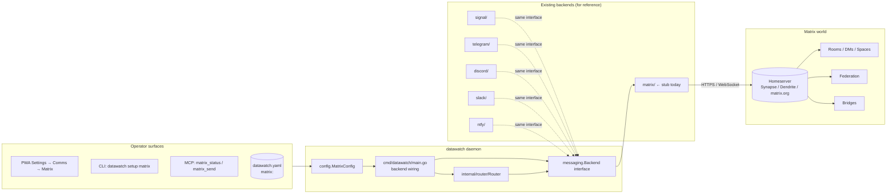
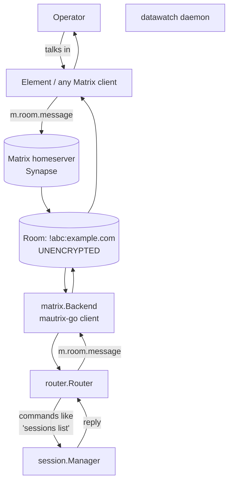
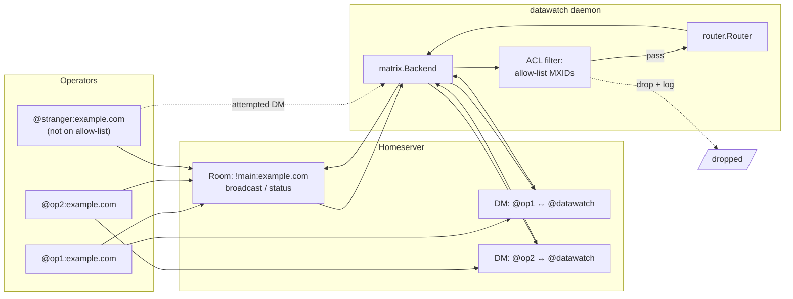
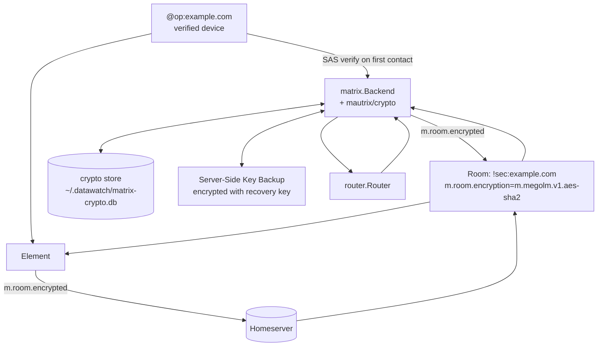

# BL241 — Matrix.org communication channel: design discussion

**Filed:** 2026-05-03 (BL241 entry in `docs/plans/README.md`)
**Status:** Design discussion — **no decisions made yet**. Operator to answer the questions in §11; this doc gets revised in place each round.
**Owner of this doc:** the design conversation between the operator and the implementing assistant.
**Why this doc exists:** Matrix is too big to specify in a single backlog line. Every other comm channel in datawatch (Signal, Telegram, Discord, Slack, Ntfy, Twilio, GitHub) maps cleanly onto the `messaging.Backend` interface with one auth model, one room/recipient model, and zero encryption. Matrix breaks every one of those simplifying assumptions, so the implementation choice has to be deliberate.

> **How to use this doc.** Each numbered "Decision Point" has options + tradeoffs and an explicit "Questions for operator" subsection. Read top-to-bottom; the diagrams in §5 are tied back to the decision points. The consolidated questions list is in §11 — answers there flow back into the per-DP sections.

---

## Table of contents

1. [Background — why Matrix is hard](#1-background--why-matrix-is-hard)
2. [Where Matrix fits in the existing comm-channel architecture](#2-where-matrix-fits-in-the-existing-comm-channel-architecture)
3. [What's already in tree (state of the matrix backend stub)](#3-whats-already-in-tree-state-of-the-matrix-backend-stub)
4. [Decision Points (DP1–DP10)](#4-decision-points-dp1dp10)
5. [Architecture diagrams per viable shape](#5-architecture-diagrams-per-viable-shape)
6. [Per-surface parity matrix](#6-per-surface-parity-matrix)
7. [Implementation phasing — three candidate paths](#7-implementation-phasing--three-candidate-paths)
8. [Testing strategy](#8-testing-strategy)
9. [Risks + things that could derail this](#9-risks--things-that-could-derail-this)
10. [Out-of-scope (explicitly deferred)](#10-out-of-scope-explicitly-deferred)
11. [Consolidated open questions for the operator](#11-consolidated-open-questions-for-the-operator)
12. [References](#12-references)

---

## 1. Background — why Matrix is hard

Matrix is a federated, decentralised messaging spec — not a single SaaS like Signal or Telegram. The Client-Server API alone covers ~40 endpoint families; the federation, application-service, and identity-service APIs cover several more. Because Matrix is federated, every "decision" datawatch-side has to be valid across **every** homeserver an operator might use — `matrix.org`, self-hosted Synapse, Dendrite, Conduit, Conduwuit, etc. — without negotiating capabilities each session.

The asymmetries that matter for datawatch:

| Asymmetry | Signal/Telegram model | Matrix |
|---|---|---|
| **Identity** | One phone number / one bot token | A user MXID per homeserver (`@bot:example.com`); the same operator may have different MXIDs on different homeservers; **application services** can claim a whole namespace (e.g. `@datawatch_*:example.com`) |
| **Auth** | Token in config | Multiple modes: password login → token, access token directly, OAuth2 (recent), OIDC (rolling out), application-service token (server-to-server). Each lets you do different things. |
| **Recipient** | Single chat ID / phone | Rooms (group), DMs (which are technically rooms), Spaces (rooms-of-rooms), encrypted rooms (different state events) |
| **Encryption** | Built-in transport TLS only (Signal: E2EE for content too, but signal-cli abstracts it) | E2EE per-room; the **client** does crypto; if datawatch joins an encrypted room without crypto support, every message is opaque ciphertext to it |
| **Federation** | N/A (centralised) | Sender + room can live on any homeserver; bridges introduce additional indirection |
| **Permissions** | Bot is admin or not | Per-room power levels (0–100) and per-event-type ACLs; sending typing notifications, reading receipts, redacting messages, joining rooms — each governed separately |
| **Bridges** | N/A | Matrix bridges to Signal/Telegram/Slack/Discord/etc. are real; an operator could already have a bridged room and want datawatch to talk to that |

Two of these — **encryption** and **bridges** — are where the design conversation matters most. Everything else can be defaulted reasonably; encryption can't.

---

## 2. Where Matrix fits in the existing comm-channel architecture

datawatch already has a stable comm-channel pattern. Every backend implements the small `messaging.Backend` interface (and optionally `ThreadedSender` / `RichSender` / `ButtonSender` / `FileSender`), gets wired in `cmd/datawatch/main.go` next to `wg.Add(1); go Router.Run(ctx)`, and gains 7-surface parity (YAML, REST, MCP, CLI, comm, PWA, locale) per the Configuration Accessibility Rule (§AGENT.md). Matrix uses this same pattern; the question is **which Matrix is being implemented** behind the interface.



Key invariants this design must preserve:

- **Configuration Accessibility Rule** (AGENT.md §382): every Matrix knob reachable from YAML + REST + MCP + CLI + comm + PWA. No Matrix-only escape hatches.
- **Localization Rule** (AGENT.md §406): every new user-facing string in all 5 locale bundles, mobile issue filed.
- **Release-discipline rules** (AGENT.md §228): the Matrix work is one feature spread across multiple patches, then a minor cut when the surface is complete.
- **Secrets store integration** (BL242): no plaintext access tokens in `datawatch.yaml` once the operator opts in to secrets — all Matrix credentials should resolve via `${secret:matrix-access-token}` etc.
- **No new top-level nav tab.** Matrix lives in Settings → Comms (post-BL247 reorg), the same card as Signal/Telegram/etc.

---

## 3. What's already in tree (state of the matrix backend stub)

A skeletal Matrix backend ships today and is wired but disabled by default.

**`internal/messaging/backends/matrix/backend.go`** (74 lines, scaffolding only):

```go
type Backend struct {
    client    *mautrix.Client
    roomID    id.RoomID
    botUserID id.UserID
}

func New(homeserver, userID, accessToken, roomID string) (*Backend, error) {
    client, err := mautrix.NewClient(homeserver, id.UserID(userID), accessToken)
    // returns Backend{client, roomID, botUserID}
}

func (b *Backend) Name() string { return "matrix" }
func (b *Backend) Send(recipient, message string) error    // unencrypted text only
func (b *Backend) Subscribe(ctx, handler) error            // m.room.message events; ignores own sends
func (b *Backend) Link(deviceName, onQR) error             { return nil }   // no-op
func (b *Backend) SelfID() string                          { return b.botUserID.String() }
func (b *Backend) Close() error                            { b.client.StopSync(); return nil }
```

**`internal/config/config.go`** already declares `MatrixConfig`:

```go
type MatrixConfig struct {
    Enabled        bool   `yaml:"enabled"`
    Homeserver     string `yaml:"homeserver"`
    UserID         string `yaml:"user_id"`
    AccessToken    string `yaml:"access_token"`
    RoomID         string `yaml:"room_id"`
    AutoManageRoom bool   `yaml:"auto_manage_room"`  // unused today
}
```

**`cmd/datawatch/main.go`** wires it the same way as Telegram:

```go
if cfg.Matrix.Enabled && cfg.Matrix.AccessToken != "" {
    matrixB, err := matrix.New(cfg.Matrix.Homeserver, cfg.Matrix.UserID, cfg.Matrix.AccessToken, cfg.Matrix.RoomID)
    // ... newRouter(...); routers = append(routers, r); go r.Run(ctx)
}
```

**`datawatch setup matrix`** CLI subcommand exists and prompts for homeserver / user-id / access-token / room-id.

**`datawatch diagnose matrix`** exists.

**Dependency** `maunium.net/go/mautrix v0.22.0` is in `go.sum`.

**What does NOT work today:**

- E2EE — `mautrix-go` ships its own crypto package (`mautrix/crypto`) that requires an additional store (SQLite or in-memory) and a key-verification flow. The stub doesn't import or initialise any of it.
- `Link()` — no-op. There's no QR / SSO / device-pairing flow for Matrix the way Signal has device linking.
- `AutoManageRoom` — flag exists, no code reads it.
- DMs — the stub treats one room ID as the only target; DMs (which are also rooms) aren't handled differently.
- Spaces — not modelled.
- Threading — not implemented; the existing `ThreadedSender` interface (used by Telegram) isn't satisfied.
- Markdown / formatted body — not implemented; `RichSender` isn't satisfied.
- Buttons / file uploads — not implemented.
- Per-room ACL — datawatch will reply to **anyone** in the configured room.
- Voice messages — not handled, even though Matrix supports `m.audio` events.
- Multi-room — only one `RoomID` per config.
- Multi-account — only one homeserver per daemon.

In other words: the stub will technically connect and echo text into one preconfigured room. Everything else is design space.

---

## 4. Decision Points (DP1–DP10)

Each decision point lays out the options with tradeoffs. **The doc deliberately does not pick.** Recommendations are noted as "your assistant's lean" (with reasoning) but are not decisions. Operator answers in §11 drive what gets implemented.

### DP1 — SDK choice

The implementing library decides what's easy and what's painful for the next 12 months.

| Option | Crypto | Federation | Bridges support | Maintenance | Notes |
|---|---|---|---|---|---|
| **A. mautrix-go** (`maunium.net/go/mautrix`) | First-class via `mautrix/crypto` (Olm/Megolm/cross-signing) | Yes (server-to-server) | Mautrix project itself ships bridges (Signal/WA/Telegram); same author | Active, weekly releases | Already in `go.sum` v0.22.0; the existing stub uses it |
| **B. matrix-org/gomatrix** (the spec's own reference Go lib) | Not built-in; would have to bolt on `mautrix/crypto` anyway | Yes | None | Sporadic; Matrix Foundation prioritises Rust SDK these days | Smaller surface area; we'd write more glue |
| **C. matrix-rust-sdk via FFI** | Most complete crypto in any SDK | Yes | None directly | Most active by far, but Rust + cgo + cross-compile pain | Cross-compile to darwin / windows / arm64 becomes a maintenance load |
| **D. Hand-roll Client-Server API** (`net/http`) | Implement Olm/Megolm ourselves | Yes (we'd implement) | None | Us | Don't. |

**Your assistant's lean:** A (mautrix-go) — already in tree, has crypto, the bridge code is the most-tested in the Go ecosystem, and the existing stub matches the API. The downside is mautrix's API has been less stable than gomatrix historically; pinning + a vendored snapshot would be wise.

**Questions for operator:**
- Q1.1 — Stay on **mautrix-go** (Option A) or switch to **gomatrix** (B)?
- Q1.2 — Are we OK pinning a specific mautrix-go minor version and only bumping it deliberately (i.e., not on every `go get -u`)?

---

### DP2 — Account model

The Matrix account that datawatch uses to talk to operators determines what it can do.

| Option | What it is | Pros | Cons |
|---|---|---|---|
| **A. Bot user** | A normal user (`@datawatch:example.com`) the operator creates manually on the homeserver. Same as today's stub. | Simple; works on every homeserver including matrix.org; no homeserver-side config needed. | Bot has user-level rate limits; can't impersonate; one bot per homeserver per datawatch installation. |
| **B. Application Service** | datawatch registers an AS that owns a namespace `@datawatch_*:example.com`. Receives a transactions feed from the homeserver instead of polling. | Higher rate limits; can ghost-create users (one per session, per channel, etc.) for clearer per-source identity; receives all events in claimed namespaces without per-room joins. | Requires homeserver admin to register the AS (write a YAML registration file, add to `homeserver.yaml`, restart); does not work on matrix.org (no AS registrations from third parties). Fundamentally only works for self-hosted operators. |
| **C. Operator-as-bot** | The operator's own Matrix account has a datawatch-managed device. datawatch authenticates as the operator. | No separate account to provision; messages "from the operator" appear correctly in shared rooms. | Conflates bot activity with operator activity; key sharing across the operator's other devices is fragile; permission boundaries blur. Generally a bad idea. |
| **D. Hybrid AS + bot fallback** | Use AS when configured, fall back to bot user when not. | Best of both worlds for operators who can self-host. | Two code paths to test. |

**Your assistant's lean:** A as the v1, with the architecture leaving room for D in v2. Option B alone excludes matrix.org users.

**Questions for operator:**
- Q2.1 — Do we support **bot user only** (A) for v1, or design for **A + B** (D) from the start?
- Q2.2 — If A, do we want to add CLI tooling to **register the bot user** (`datawatch setup matrix create-account`) or assume the operator does it manually first?

---

### DP3 — Authentication

How the daemon obtains the access token.

| Option | UX | Token rotation | Notes |
|---|---|---|---|
| **A. Operator pastes access token** | Manual: log in to Element, copy the token from Settings → Help & About → Advanced. | Manual when it expires (matrix.org tokens do not expire by default; some homeservers issue short-lived tokens). | Today's stub. Easy. |
| **B. Operator pastes username + password; daemon does `/login`** | Two-step: paste creds, daemon does the round-trip and stores the resulting token. | Daemon can re-`/login` if the token gets invalidated. | Password handling: store via secrets store (BL242) or never-store-only-use-once? |
| **C. SSO / OIDC web flow** | Operator opens a URL, completes their org's SSO, daemon receives the token via redirect. | Tokens refresh per OIDC. | Most complex; requires daemon to expose a callback URL; not all homeservers support SSO. |
| **D. Application Service token** | Configured in the homeserver's `registration.yaml`; static. | Doesn't rotate; operator regenerates on the homeserver. | Only viable if DP2 = B or D. |
| **E. Mixed (daemon picks based on config presence)** | Whichever fields are set wins. | n/a | Standard pattern in datawatch (e.g., LLM backend selection). |

**Your assistant's lean:** A as v1 (existing flow works). Add B in v2 (small lift, big UX win). C is its own initiative (SSO is per-org); defer. D follows DP2.

**Questions for operator:**
- Q3.1 — v1 = **access-token paste only** (A), or do we add **username+password** (B) at the same time?
- Q3.2 — Where do Matrix credentials live? Plaintext in `datawatch.yaml`, or **must** they go through the secrets store (`${secret:matrix-access-token}`) once BL242 ships? (BL242 is shipped; the policy choice remains.)
- Q3.3 — Is OIDC/SSO (C) ever in scope, or always operator-driven outside datawatch?

---

### DP4 — Encryption (E2EE)

This is the single biggest design decision in the doc. Matrix encryption is per-room state, not server-wide. A datawatch bot that can't decrypt sees `m.room.encrypted` events with opaque ciphertext.

| Option | Scope | Operator UX | Implementation cost | Risk |
|---|---|---|---|---|
| **A. No E2EE (cleartext only)** | Bot only joins unencrypted rooms; refuses encrypted invites. | Operator must create an unencrypted room. (Element's default is **encrypted-on-create** for DMs.) | Low — today's stub already does this. | If operator misconfigures, every message looks broken. Most real-world Matrix usage is encrypted. |
| **B. E2EE always required** | Bot only joins encrypted rooms; manages keys via `mautrix/crypto`. | Bot must verify (cross-sign / SAS) on first contact. | High — crypto store, key backup, device-list updates, megolm session sharing. | If the crypto store gets corrupted, the bot loses access to historical messages until rekey; debugging crypto bugs is hard. |
| **C. E2EE supported, cleartext supported, per-room negotiation** | Bot accepts whatever the room is. Sends in the room's mode. | Same as A or B per room. | High (still need crypto for option-B rooms). | Most flexible but most surface area. |
| **D. Strict cleartext + warn-on-encrypted** | Bot joins encrypted rooms but refuses to send/decrypt and posts a warning to the operator's notification channel. | Operator sees clearly when something is wrong. | Low + warn path. | Bot is functionally useless in encrypted rooms; this is just an "honest stub" mode. |

**Sub-decision (only relevant if E2EE is in scope):**

- **Crypto store backend.** mautrix-go's crypto package needs persistent storage. Options: SQLite file at `~/.datawatch/matrix-crypto.db` (recommended, isolated), or piggyback on the existing daemon SQLite (cleaner but tight coupling).
- **Verification UX.** First-message verification needs a flow:
  - **a)** Operator scans an emoji SAS in their Matrix client
  - **b)** Operator passes the bot's session key out-of-band on `datawatch setup matrix`
  - **c)** Auto-trust everything (insecure; defeats the point)
- **Key backup.** Should the bot back up its megolm session keys to the homeserver (encrypted with a recovery key) so it survives device wipes? Adds complexity but matches Element's default.
- **Device verification model.** Cross-sign with the operator's own MXID, or treat the bot as a separate identity that doesn't cross-sign?

**Your assistant's lean:** D for v1 (cleartext-only with a clear warning when an encrypted room is encountered) and B for a v2 dedicated to crypto. Reasoning: crypto is a 2-3-week implementation by itself with non-trivial test surface, and shipping a half-broken crypto backend is worse than shipping no crypto with a clear error.

**Questions for operator:**
- Q4.1 — v1 scope: **cleartext only with warn** (D), **cleartext only with refuse** (A), or **E2EE in scope from day one** (B/C)?
- Q4.2 — If E2EE is ever in scope: SAS verification (a), out-of-band key (b), or auto-trust + audit (c)?
- Q4.3 — Does the bot do **key backup** to the homeserver, or are session keys local-only (lose on `~/.datawatch/` wipe)?
- Q4.4 — Is the bot a **separate identity** or does it **cross-sign with the operator's MXID**?

---

### DP5 — Routing model (rooms / DMs / spaces / multi-room)

Matrix has more "where do messages go" choices than any other backend datawatch ships.

| Model | Description | Pros | Cons |
|---|---|---|---|
| **A. One room, fixed in config** | Today's stub. Bot joins one preconfigured room; all sends go there; all receives come from there. | Simple; matches Telegram's `chat_id` shape. | Loses Matrix's primary advantage (multi-room organisation); doesn't model DMs. |
| **B. One room + DM-per-operator** | Bot joins one main room (broadcast / state) AND any operator can DM the bot for private commands. | Mirrors Signal's model (group + per-operator DM). | Need to detect DM rooms vs group rooms (`m.direct` event vs membership count vs both). |
| **C. Room-per-session** | Each datawatch session opens a Matrix room named `datawatch-<session-id>`; the operator gets invited. | Best per-session UX (Matrix threads aren't as good as separate rooms); easy notification scoping. | Room sprawl; operator's room list fills with stale rooms; needs a "close & archive" verb. |
| **D. Spaces (rooms-of-rooms)** | One Matrix Space per datawatch project / cluster / etc.; sessions land as rooms inside the space. | Maps cleanly onto datawatch's project / cluster abstractions. | Spaces are still maturing; not all clients render them well. Adds a lot of state events. |
| **E. Operator-defined per-channel** | Config has `routes: [{name: "general", room: "!abc:..."}, {name: "alerts", room: "!def:..."}]`; comm-channel commands like `route set <session> <route>` aim sessions at routes. | Maximum flexibility; matches the existing routing-rules feature. | More YAML; operator has to design their room layout. |

**Sub-decision (only if B is in scope):**

- DMs imply consent flows. If a stranger DMs the bot, does it auto-respond? Auto-reply with "you're not on the allow-list"? Ignore silently?

**Your assistant's lean:** A in v1 (matches the existing stub and Telegram), B in v2 (Signal parity), E as a stretch. C and D are cool but they're separate features that should be backlogged on their own (BL241-followup).

**Questions for operator:**
- Q5.1 — v1 routing: **A** (single room) or **B** (single room + DMs)?
- Q5.2 — If DMs are in scope: **allow-list of operator MXIDs**, or **ack-and-ignore** unknown senders, or **bounce with help text**?
- Q5.3 — Is **room-per-session** (C) appealing enough that we should design for it now even if implementation comes later? (i.e., should the v1 message format include a `session_id` somewhere structured so a later C layer can route on it?)
- Q5.4 — **Spaces** (D) — defer entirely, or design the room-naming convention now so future Spaces work isn't a rewrite?

---

### DP6 — Federation behaviour

Matrix users can live on any homeserver, and rooms can be federated across many. The bot's homeserver matters less than which rooms it joins.

| Question | Options |
|---|---|
| Does the bot only join rooms hosted on its own homeserver? | A. Yes (least surprise; refuses cross-server invites) · B. No (joins anywhere it's invited) |
| What does the bot do when a federated user (`@stranger:other.org`) sends to a room it's in? | A. Ignore (allow-list mode; operator has to whitelist) · B. Process the same as same-server users · C. Process but tag the source (`from: matrix:other.org`) so audit log captures it |
| Cross-federation E2EE? | If E2EE is enabled (DP4), federated rooms still encrypt end-to-end; the bot must handle keys for users on other homeservers |

**Your assistant's lean:** B (no homeserver lock-in) + C (process federated, tag source). Locking the bot to one homeserver defeats Matrix's central design.

**Questions for operator:**
- Q6.1 — Federation policy: **bot's homeserver only**, or **anywhere it's invited**?
- Q6.2 — Federated-sender behaviour: **ignore unless allow-listed**, **process same as local**, or **process + tag source**?

---

### DP7 — Inbound message filtering / ACL

Datawatch's existing comm channels assume "if you're in the configured room, you're authorised." Matrix may need finer ACLs because rooms are easier to invite people to.

| Option | Description |
|---|---|
| **A. Trust everyone in the room** | Same as Signal/Telegram today. |
| **B. Allow-list of MXIDs** | Only `@operator:example.com` (and a configured list) can issue commands; others' messages are stored but ignored. |
| **C. Power-level gate** | Only senders with power-level ≥ N (e.g., 50 = moderator) can issue commands. |
| **D. Hybrid** | Default A; if `matrix.acl` is set, switch to B or C. |

**Your assistant's lean:** D — default to A (consistent with Signal/Telegram), opt in to B for higher-security setups.

**Questions for operator:**
- Q7.1 — Do we ship an ACL in v1 (B/C/D), or trust the room (A) and add ACLs in v2?
- Q7.2 — If ACL in v1: is it the operator's MXID hard-coded in config, or a list?

---

### DP8 — Bridges (Matrix ↔ other networks)

A Matrix room can be bridged to Signal, Telegram, Slack, Discord, IRC, etc. via mautrix bridges and others. The bot doesn't need to know it's bridged — it just sees Matrix events. **But:**

- Sender names from bridges look like `@signal_+15555550100:matrix.example.com` — does the operator want these mapped back to phone numbers / handles?
- Files coming from a bridged source have larger latency.
- The "bridge ghost" user can flap if the bridge restarts; should the bot track that?

**Your assistant's lean:** Out of scope for v1. Bridges work transparently because Matrix is consistent end-to-end; the bot doesn't need to know. Optional v2 enhancement: pretty-print bridge-ghost MXIDs.

**Questions for operator:**
- Q8.1 — Confirm bridge-awareness is **out of scope** for the initial Matrix BL241 work, with a future BL for "bridge user detection + display".

---

### DP9 — Operator linking / first-time setup flow

How does the operator go from "I want to enable Matrix" to "datawatch is live in my room"?

| Step | Today (CLI only) | Could be |
|---|---|---|
| 1. Provide homeserver URL | `datawatch setup matrix` prompts for it | Same; PWA Settings → Comms → Matrix has a form |
| 2. Provide MXID + access token | Prompts | PWA form. If DP3 = B, prompt for password, daemon does `/login`. |
| 3. Provide room ID | Prompts (`!abcdef:matrix.org`) | Room ID is hard for humans. **Better:** operator provides a room **alias** (`#datawatch:matrix.org`) and daemon resolves it. **Best:** operator pastes a `matrix:` URI from Element. |
| 4. Verify connectivity | `datawatch diagnose matrix` | PWA shows status badge; reload-after-save checks connectivity |
| 5. Bot joins the room | Operator has to invite the bot manually from their Matrix client first | Could be automated if `auto_manage_room` flag is implemented (bot creates a room and invites the operator) |
| 6. (E2EE only) Verify the bot's device | Operator does SAS in Element | Same; could surface the SAS emojis in the PWA so operator types them in Element |

**Your assistant's lean:** Phase 1 = parity with today's CLI flow + a PWA form. Phase 2 = room-alias resolution + auto-invite. Phase 3 = E2EE verification helper.

**Questions for operator:**
- Q9.1 — Should v1 support **room alias** (`#datawatch:matrix.org`) input, or is the raw room ID OK?
- Q9.2 — Is **auto-create a room and invite operator** a v1 feature (the existing `AutoManageRoom` flag), or v2?
- Q9.3 — If E2EE: should the PWA show **SAS emojis** so operator can verify directly from the PWA without opening Element?

---

### DP10 — Configuration model

How config is shaped affects every other decision and especially the upgrade path.

| Option | Shape | Notes |
|---|---|---|
| **A. Single block, like today** | `matrix: {enabled, homeserver, user_id, access_token, room_id}` | Easy. Doesn't model multiple rooms / accounts. |
| **B. Single block + room list** | `matrix: {homeserver, user_id, access_token, rooms: [...]}` | Supports DP5 model E. |
| **C. List of accounts** | `matrix: [{homeserver: ..., user_id: ..., rooms: [...]}, {...}]` | Models multiple homeservers. Probably overkill for v1. |
| **D. Single block + secrets refs** | `matrix: {homeserver, user_id, access_token: "${secret:matrix-token}", room_id}` | Mandatory after BL242; just wiring. |

**Migration concern:** today's stub uses Option A. Moving to B is a YAML schema change; we'd want to keep Option A working as a single-room shorthand.

**Your assistant's lean:** A + D for v1 (extending the existing stub minimally), with the YAML schema designed so adding a `rooms:` list later is a non-breaking superset.

**Questions for operator:**
- Q10.1 — Confirm v1 sticks with **single account, single room** YAML shape, just adding secret-ref support.
- Q10.2 — Should `room_id` accept a **room alias** as well as a room ID (transparently resolved)?

---

## 5. Architecture diagrams per viable shape

These are the three shapes the operator's answers to DPs above are most likely to land us on.

### Shape α — "Matrix-as-Telegram-clone" (cleartext, single room, single bot)

The minimum-viable shape that brings the existing stub to feature-complete. Equivalent to how Telegram works today.



Properties: deterministic, no crypto state, no key management, fits the existing comm-channel test harness.

---

### Shape β — "Signal-parity Matrix" (cleartext, room + DMs, allow-list)

What Signal does today but on Matrix: a main room for broadcast + each operator can DM the bot for private commands. Implements DP5 = B and DP7 = B.



---

### Shape γ — "Encrypted Matrix" (E2EE everywhere, single room or DMs, key backup)

Implements DP4 = B (or C). Adds the full crypto stack.



The crypto store is the new state surface (matrix sessions, room keys, device keys). Loss of the crypto store = loss of decryption for historical messages until rekey. Backup is recommended.

---

## 6. Per-surface parity matrix

Per the Configuration Accessibility Rule, every Matrix knob has to be reachable from every operator surface. This table is the v1 acceptance criterion.

| Knob | YAML | REST | MCP | CLI | Comm | PWA | Locale |
|---|---|---|---|---|---|---|---|
| Enable / disable | `matrix.enabled` | `PUT /api/config` (existing) | `config_set` (existing) | `datawatch config set matrix.enabled true` | `configure matrix.enabled true` | Settings → Comms → Matrix toggle | `comm_matrix_enabled` |
| Homeserver URL | `matrix.homeserver` | same | same | same | same | text input | `comm_matrix_homeserver` |
| MXID | `matrix.user_id` | same | same | same | same | text input | `comm_matrix_user_id` |
| Access token | `matrix.access_token` (or `${secret:...}`) | same | same | same | same | password-style input | `comm_matrix_access_token` |
| Room ID / alias | `matrix.room_id` | same | same | same | same | text input + (v2) "browse joined rooms" | `comm_matrix_room_id` |
| Auto-manage room | `matrix.auto_manage_room` | same | same | same | same | toggle | `comm_matrix_auto_manage` |
| Status (read-only) | n/a | `GET /api/matrix/status` | `matrix_status` | `datawatch matrix status` | `matrix status` | Settings → Comms → status badge | `comm_matrix_status_*` |
| Test send | n/a | `POST /api/matrix/test` | `matrix_test` | `datawatch matrix test [room]` | `matrix test` | "Send test message" button | `comm_matrix_test_*` |
| (DP5=B) DMs enabled | `matrix.dms.enabled` | … | `matrix_dms_*` | `datawatch matrix dms` | `matrix dms` | DM section in card | `comm_matrix_dms_*` |
| (DP7) ACL allow-list | `matrix.acl.allowed_mxids: [...]` | … | `matrix_acl_*` | `datawatch matrix acl add @op:server` | `matrix acl add @op:server` | List editor | `comm_matrix_acl_*` |
| (DP4) Encryption mode | `matrix.encryption: cleartext\|warn\|required` | … | `matrix_encryption_*` | … | … | Dropdown | `comm_matrix_encryption_*` |
| (DP4) Crypto store path | `matrix.crypto_store: ~/.datawatch/matrix-crypto.db` | … | … | … | … | path picker (read-only) | `comm_matrix_crypto_store` |
| Diagnose | n/a | n/a | n/a | `datawatch diagnose matrix` (exists) | `diagnose matrix` | "Run diagnose" button | `comm_matrix_diagnose_*` |

mobile (datawatch-app) parity is filed as the standard issue per the Localization Rule once the v1 ships.

---

## 7. Implementation phasing — three candidate paths

The phase plan depends on the answers to DP4 (E2EE) more than anything else. Three plans laid out; operator picks one.

### Plan I — "Cleartext-first, E2EE later" (recommended if v1 needs to ship in a single minor)

Targets Shape α + most of Shape β by v6.7.0, defers Shape γ to v6.8.0 or beyond.

| Phase | Target | Scope |
|---|---|---|
| **P1** | v6.7.0-α (≈3 days) | Matrix backend feature-complete for cleartext: Send + Subscribe + AutoJoin + reject encrypted rooms with operator notification. `RichSender` (Markdown). `ThreadedSender` via Matrix threads. Status + test endpoints across all 7 surfaces. Locale keys. Mobile issue filed. |
| **P2** | v6.7.0-β (≈2 days) | DM support (Shape β). Allow-list ACL. Auto-invite operator on room create (`auto_manage_room`). Room-alias resolution. |
| **P3** | v6.7.0-γ (≈1 day) | PWA Settings card with status, test button, ACL editor. Diagnose panel. |
| **P4** | v6.8.0 (when scheduled) | E2EE: `mautrix/crypto` integration, SAS verification flow, key backup, encrypted-room support. New top-level encryption config block. PWA SAS-verification helper. |

### Plan II — "Encrypted-from-day-one"

Targets Shape γ in v6.7.0. Higher initial effort, no half-feature shipped.

| Phase | Target | Scope |
|---|---|---|
| **P1** | v6.7.0-α (≈4 days) | Cleartext backend feature-complete (same as Plan I P1). |
| **P2** | v6.7.0-β (≈5 days) | E2EE: crypto store, megolm session management, device list updates, megolm key sharing. |
| **P3** | v6.7.0-γ (≈3 days) | SAS verification flow + key backup. PWA verification helper. |
| **P4** | v6.7.0-δ (≈2 days) | DMs + ACL + auto-manage room (Plan I's P2). |
| **P5** | v6.7.0-ε (≈1 day) | PWA card, diagnose panel (Plan I's P3). |

### Plan III — "Stub it, gate it, learn"

Smallest possible v1: ship Shape α with conservative defaults, get one operator using it, design v2 from real-world feedback.

| Phase | Target | Scope |
|---|---|---|
| **P1** | v6.7.x (≈2 days) | Bring existing stub to "actually works" — fix Send error handling, implement basic Subscribe filtering, refuse encrypted rooms loudly, surface status across all 7 surfaces. **No new features.** |
| **P2** | follow-on BL | Everything else (DMs, ACL, E2EE) gets its own design conversation when an operator hits the gap. |

**Your assistant's lean:** Plan I is the right balance for a single minor cut; Plan III is the right balance if you want a real-world signal first.

**Questions for operator:**
- Q-Phase.1 — Which plan: I, II, or III?
- Q-Phase.2 — Target version (v6.7.0 minor, v6.7.x patches, v7.0.0 major)?
- Q-Phase.3 — Is there an operator-side Matrix homeserver where we test this, or do we use matrix.org for development?

---

## 8. Testing strategy

What "verified" means at each phase boundary.

| Test type | Coverage |
|---|---|
| **Unit** | Mock `mautrix.Client`; assert: Send routes to right room; Subscribe filters own messages; encrypted-room rejection emits the right warning; ACL allow/deny matches expectations; alias→ID resolution. |
| **Integration** | Spin up a local Synapse (Docker) in `scripts/test-matrix.sh`. Bot joins a room, exchanges messages with a `python-matrix-nio` test client, verifies bidirectional delivery + audit log entries. |
| **E2EE integration (Plan II only)** | Same harness with `m.room.encryption` enabled in the test room. Verify the bot can decrypt messages from the test client and the test client can decrypt the bot's messages. SAS emojis match. Key backup + restore works across crypto-store wipe. |
| **Smoke (`scripts/release-smoke.sh`)** | New section "§N. Matrix channel": registers a test peer, sends a test message via daemon API, asserts it appears in the audit log. Skip if `cfg.Matrix.Enabled` is false (consistent with how other channel sections skip). |
| **Manual** | PWA test-button round-trip; CLI `datawatch diagnose matrix`; comm verb `matrix test`; verifies the new locale keys render in all 5 languages. |

---

## 9. Risks + things that could derail this

- **mautrix-go API churn.** Major-version bumps in the past have broken downstream integrations. Mitigation: pin the minor; vendor if necessary; write adapter layer thin so a future SDK swap is feasible.
- **E2EE crypto-store corruption** (Plan II). Mitigation: `~/.datawatch/matrix-crypto.db` has its own SQLite file with WAL mode + the standard backup recipe; daemon refuses to start if the store can't be opened, with a clear remediation message.
- **Federation outages.** A user's homeserver going down means their messages stop arriving; the bot should not consider this a fatal error — it's a transient federation issue. Mitigation: surface as a warning, not a crash; alert via the existing alert stream.
- **Rate limiting.** matrix.org is aggressive about rate limits for bots that aren't application services. Mitigation: backoff on `M_LIMIT_EXCEEDED`; surface limits in `datawatch matrix status`; document in setup help that self-hosted homeservers are recommended for heavy use.
- **Large room joins.** Some rooms have 50k+ members and joining them downloads enormous state. Mitigation: surface a warning before joining a room with `>1000 members`; provide a `--lazy-load` option.
- **Bot user policy.** Some homeservers block bot registrations; matrix.org requires a CAPTCHA. Mitigation: documented in setup help; can't fix from datawatch side.
- **Bridge identity collisions.** Bridge ghosts may share an MXID prefix; if ACL is by MXID, this could accidentally allow bridged users in. Mitigation: ACL config supports MXID patterns, not just exact matches.

---

## 10. Out-of-scope (explicitly deferred)

These are NOT in BL241; they get their own backlog entries when relevant.

- **Application Service mode** (DP2 Option B / D). v2.
- **Spaces** (DP5 Option D). Separate BL.
- **Room-per-session** (DP5 Option C). Separate BL.
- **OIDC / SSO** (DP3 Option C). Separate BL.
- **Bridge user pretty-printing** (DP8). Separate BL.
- **Voice messages** (`m.audio` events ↔ Whisper). Could ride on the existing voice-input infra; separate BL.
- **Image / file uploads to a room.** `FileSender` interface implementation; separate BL after v1.
- **Matrix as the carrier for the inter-mesh control plane** referenced in BL243's "Future" notes. Separate BL once Tailscale mesh has a few production users.
- **Multi-homeserver / multi-account** (DP10 Option C). Separate BL.

---

## 11. Consolidated open questions for the operator

The full list, ordered by what blocks what. Answer in any format — these flow back into the per-DP sections.

### A. Foundational — answer these first; everything else depends on them

- **Q4.1** — E2EE in v1? **(D) cleartext-only with warn**, **(A) cleartext-only with refuse**, or **(B/C) E2EE in scope from day one**? — _This decides Plan I vs Plan II._
- **Q-Phase.1** — Which implementation plan: **I**, **II**, or **III**?
- **Q-Phase.2** — Target version: **v6.7.0 minor**, **v6.7.x patches**, **v7.0.0 major**?
- **Q-Phase.3** — Is there an operator-side Matrix homeserver to test against, or do we use matrix.org?

### B. Account + auth

- **Q1.1** — Stay on **mautrix-go** or switch to **gomatrix**?
- **Q1.2** — Pin mautrix-go minor version (deliberate bumps only)?
- **Q2.1** — v1 = **bot user only** (A) or **bot user + application service** (D)?
- **Q2.2** — Does CLI offer **bot-user creation** (`datawatch setup matrix create-account`)?
- **Q3.1** — v1 = **access-token paste** (A) or also **username+password login** (B)?
- **Q3.2** — Matrix credentials: plaintext in YAML or **must** go through secrets store (`${secret:matrix-token}`)?
- **Q3.3** — Is OIDC/SSO ever in scope?

### C. E2EE (only if Q4.1 = B/C)

- **Q4.2** — Verification: **SAS** (a), **out-of-band key** (b), or **auto-trust + audit** (c)?
- **Q4.3** — Key backup to homeserver, or local-only?
- **Q4.4** — Bot is a **separate identity** or **cross-signs with operator MXID**?

### D. Routing + ACL

- **Q5.1** — v1 routing: **single room** (A) or **single room + DMs** (B)?
- **Q5.2** — DM unknown-sender behaviour (if B): **allow-list**, **ack-and-ignore**, or **bounce with help**?
- **Q5.3** — Should we design the v1 message format so future **room-per-session** can layer in cleanly (i.e., embed `session_id` somewhere structured)?
- **Q5.4** — **Spaces** — defer entirely or design room-naming convention now?
- **Q6.1** — Federation: **bot's homeserver only** or **anywhere invited**?
- **Q6.2** — Federated-sender behaviour: **ignore unless allow-listed**, **process same as local**, or **process + tag source**?
- **Q7.1** — Ship an **ACL in v1** (B/C/D), or trust the room (A)?
- **Q7.2** — If ACL: **single operator MXID** or a **list**?

### E. Bridges + UX + config

- **Q8.1** — Confirm bridges = **out of scope for v1**.
- **Q9.1** — v1 supports **room aliases** (`#datawatch:matrix.org`)?
- **Q9.2** — `auto_manage_room` (auto-create + invite operator) — v1 or v2?
- **Q9.3** — If E2EE: **show SAS emojis in PWA** for verification?
- **Q10.1** — v1 YAML stays **single-account, single-room** plus secret refs?
- **Q10.2** — `room_id` accepts **room alias** transparently?

---

## 12. References

- [Matrix specification index](https://spec.matrix.org/latest/) — entry point for Client-Server, Application Service, Federation, Identity Service APIs.
- [`maunium.net/go/mautrix`](https://github.com/mautrix/go) — primary Go SDK; current version in `go.sum` is v0.22.0.
- [mautrix/crypto subpackage](https://pkg.go.dev/maunium.net/go/mautrix/crypto) — Olm/Megolm implementation if E2EE is in scope.
- [matrix-org/synapse](https://github.com/element-hq/synapse) — reference homeserver for integration tests.
- [matrix-appservice-bot examples](https://github.com/turt2live/matrix-bot-sdk) — patterns for bot-user vs AS account models, even though our impl is Go-side.
- BL242 (closed v6.4.7) — secrets store integration target for `${secret:matrix-token}`.
- BL244 (closed v6.3.0) — Plugin Manifest v2.1; Matrix is **not** a plugin (it's a first-class comm channel like Signal), but the comm-command routing pattern is the same.
- AGENT.md §382 (Configuration Accessibility Rule) — drives the parity matrix in §6.
- AGENT.md §406 (Localization Rule) — drives the locale + mobile issue requirement.
- AGENT.md §228 (Release-discipline rules) — drives the phase plan in §7.

---

## Appendix A — answers log (fill in as the operator answers)

_Empty. Each operator answer round appends a dated section here so this doc shows the evolution of the design, not just the final state._
