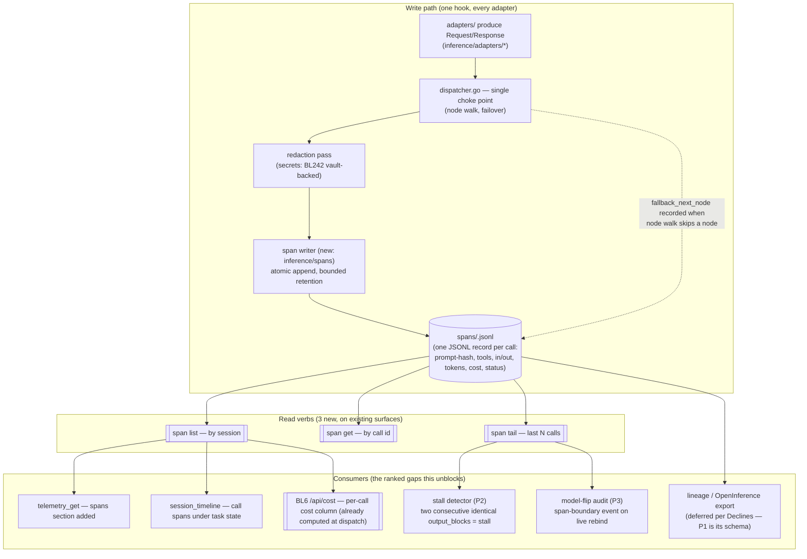

# Harness Research — Diagrams

**Date:** 2026-09-30 (close-out) · **Status:** Final · **Companion:** `synthesis.md`, `usage-patterns.md`, `datawatch-mapping.md`, `enhancement-proposals.md`

All patterns below are from `usage-patterns.md` (ranked by builder count across the 20 in `case-studies.md`). All package references are real directories under `internal/` as of v8.37.4 (see `datawatch-mapping.md` verification footnotes). Diagrams are conceptual — no code.

---

## 1. Recurring builder patterns → datawatch internal packages

A builder pattern is a box; the packages that would (do) implement it are boxes to its right. Edges labelled **own** = implemented today as a first-class surface (MATCH in `datawatch-mapping.md`); edges labelled **gap** = the named delta (`datawatch-mapping.md` ranked gaps #1–#5).

```mermaid
flowchart LR
    subgraph BUILDERS["Builder patterns (usage-patterns.md, 20 builders)"]
        P1["durable-state-continuity (10)"]
        P2["behaviour-as-files (10)"]
        P3["isolated-agent-context (9)"]
        P4["human-approval-gate (9)"]
        P5["bounded-loops-cost-accounting (8)"]
        P6["tiered-model-routing (7)"]
        P7["recorded-run-artifacts (7)"]
        P8["boundary-guardrails (6)"]
        P9["scoped-memory-promotion (6)"]
        P10["local-inference-tier (6)"]
        P11["task-plan-passfail (5)"]
        P12["test-gated-loop (5)"]
        P13["independent-verifier (4)"]
        P14["structured-debate (2)"]
        P17["remote-operator-surface (2)"]
    end

    subgraph DW["datawatch internal packages"]
        session["session<br/>(tmux lifecycle, lineage, rollback)"]
        memory["memory<br/>(scope stack, WAL, seed/harvest)"]
        autonomous["autonomous<br/>(PRD executor, quality gates, verifier)"]
        skills["skills / plugins<br/>(BL255 registry, manifests)"]
        profile["profile<br/>(Project/Cluster, AGENT.md)"]
        agents["agents<br/>(F10 docker/k8s/Cf drivers)"]
        capacity["capacity<br/>(host/node/llm pool ledger)"]
        llm["llm<br/>(v7 registry, failover list)"]
        compute["compute<br/>(ComputeNode, GPU mem)"]
        inference["inference<br/>(adapters, dispatcher)"]
        evals["evals<br/>(BL259 suites, runs)"]
        orchestrator["orchestrator<br/>(BL117 PRD-DAG)"]
        council["council<br/>(BL260 personas, runs)"]
        messaging["messaging<br/>(12 backends)"]
        tailscale["tailscale<br/>(BL243 headscale)"]
        secrets["secrets<br/>(BL242 vault-backed)"]
        audit["audit<br/>(BL9 JSON-lines)"]
        observer["observer<br/>(eBPF envelopes, GPU)"]
        alertrules["alertrules / alerts<br/>(per-pod rules)"]
    end

    P1 ---|"own"| session
    P1 ---|"own"| memory
    P1 ---|"own"| autonomous
    P2 ---|"own"| skills
    P2 ---|"own"| profile
    P2 ---|"own"| plugins["plugins"]
    P3 ---|"own"| agents
    P3 ---|"own"| capacity
    P3 ---|"own"| session
    P4 ---|"own"| autonomous
    P4 ---|"own"| alertrules
    P4 ---|"own"| orchestrator
    P5 ---|"own"| audit
    P5 ---|"own"| capacity
    P5 ---|"gap #2"| inference
    P6 ---|"own"| llm
    P6 ---|"own"| inference
    P6 ---|"gap #2/#3"| autonomous
    P6 ---|"gap #5"| compute
    P7 ---|"own"| session
    P7 ---|"own"| observer
    P7 ---|"own"| memory
    P7 ---|"gap #1 (MISSING)"| inference
    P8 ---|"own"| autonomous
    P8 ---|"own"| secrets
    P8 ---|"own"| validators["validator"]
    P9 ---|"own"| memory
    P10 ---|"own"| compute
    P10 ---|"own"| llm
    P10 ---|"gap #5"| capacity
    P11 ---|"own"| autonomous
    P11 ---|"own"| orchestrator
    P12 ---|"own"| autonomous
    P12 ---|"own"| evals
    P13 ---|"own"| autonomous
    P13 ---|"own"| evals
    P14 ---|"own"| council
    P14 ---|"gap (PARTIAL)"| council
    P17 ---|"own"| messaging
    P17 ---|"own"| tailscale
    P17 ---|"own"| channel["channel"]
```

> **Note on `validator`:** the package directory exists (`internal/validator`); the pattern 8/12 evidence in the mapping table is the SAST/secrets/dep scanner set, which `datawatch-mapping.md` places under `internal/autonomous/scan`. Treat both packages as co-homes of the boundary-guardrail pattern until the mapping is re-verified.

---

## 2. Top recommendation — P1 (per-LLM-call span artifact) — proposed data flow

From `enhancement-proposals.md` P1. Conceptual, not code: one JSONL append per LLM call at the single choke point (the dispatcher), three read verbs, and the downstream consumers that each of the ranked gaps needs. `spans/` is the new store (modeled on the existing memory-WAL append shape in `internal/memory`), shown as a new box.

**Why this flow and not a new tracing stack:** the writer needs zero new adapter work (every adapter already serializes its call through `Request`/`Response` at the dispatcher boundary — `internal/inference/dispatcher.go`), the store reuses the daemon's existing append-only JSONL convention (memory-WAL), and every read-side consumer is an existing surface getting a new section/verb, not a new subsystem. That is what makes P1 the S-surface-area recommendation in `enhancement-proposals.md` despite closing the only MISSING-ranked gap.

---

*Documentation only — no code. All package names in both diagrams are verified-present directories under `internal/` as of v8.37.4.*
