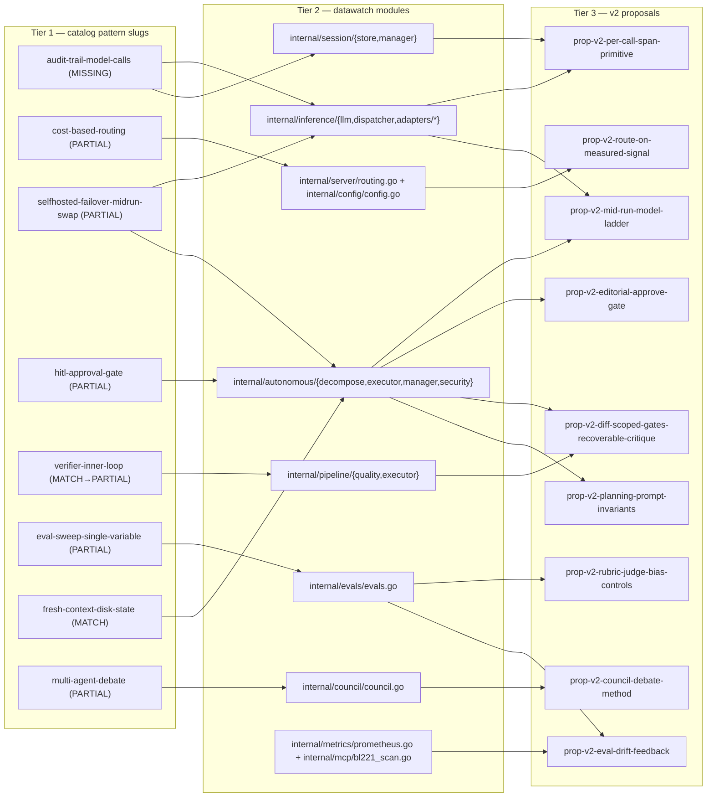

# DataWatch — Harness Research Enhancements v2 (Practitioner-Research Pass)

**Date:** 2026-09-18 (pass) · **Status:** Draft
**Companion (this pass, Sept 17-19):** `case-studies.md` (17 individual builders), `usage-patterns.md` (12 recurring cross-builder patterns), `candidates.md`, `datawatch-mapping.md` (gap analysis vs baseline)
**Baseline:** `AGENT.md`, `DATAWATCH-CONTEXT.md`
**Prior framework-era pass (Sept 7-11, NOT re-stated here):** `synthesis.md`, `enhancement-proposals.md` (#1-#5), `feature-themes.md` (#1-#6), `examples-catalog.md` (16 public vendor harnesses), `impact-matrix.md`, `methodology.md`

---

## Pass scope

This is the **practitioner-research pass**. It is grounded in the evidence produced the same week by the 17 individual builder case studies (`case-studies.md`), the 12 recurring usage patterns abstracted from them (`usage-patterns.md`), and the gap analysis that matches those patterns against the datawatch baseline (`datawatch-mapping.md`).

It relates to the **Sept 7-11 framework pass** as follows. The framework pass cataloged 16 *public vendor harnesses* (`examples-catalog.md`) and produced five framework-level proposals (`enhancement-proposals.md` #1-5) plus six candidate themes (`feature-themes.md` #1-6). This pass does **not** re-state those. Where a gap in `datawatch-mapping.md` is **already claimed** by a Sept 7-11 proposal, this pass either lands a **prerequisite** that proposal assumes, or **delegates to it** and does not re-propose:

- `enhancement-proposals.md` #1 (eval sweep, suite × backend matrix) and #2 (eval node in the BL117 DAG) — **claimed**; not re-proposed. This pass extends them with the per-case rubric/judge-bias/canary doctrine (see `prop-v2-rubric-judge-bias-controls`) and adds the longitudinal drift layer on top (see `prop-v2-eval-drift-feedback`).
- `enhancement-proposals.md` #3 (unified lineage query + OpenInference export) — **claimed; assumed**. This pass lands the *write-side* per-LLM-call primitive that #3's read-side query **depends on but never lands** (see `prop-v2-per-call-span-primitive`). The delta is explicitly the write-vs-read side.
- `enhancement-proposals.md` #4 (grounding metrics for docs_search) and #5 (red-team validator pipeline deepening BL369) — **claimed**; not re-proposed in this pass.
- `feature-themes.md` #6 (quality- and cost-aware routing) — **named as a theme** but not yet a concrete proposal. This pass promotes it to a concrete proposal with a specified input contract and the cheapest-first-passing rule (see `prop-v2-route-on-measured-signal`), and adds the reactive escalation ladder it implies (see `prop-v2-mid-run-model-ladder`).

Method per the task: each proposal below borrows a technique from **1-3 individual case-study entries** in `case-studies.md`, maps it to a **datawatch surface (feature + BL number)** and the **modules it would touch** (named from the live source tree, not invented), and gives an **implementation sketch in prose only** — no code, no `.go` diffs. Ratings are **complexity S/M/L**, **impact H/M/L**, plus **top 1-2 risks**, and an explicit **"differs from existing proposal"** note wherever one applies.

---

## Proposals

### `prop-v2-per-call-span-primitive`

**Name.** Per-LLM-call transaction record on the inference adapters.

**What it is.** One queryable artifact per model call, captured on the write side of the inference path: the assembled system prompt, the tool schemas offered, the input messages, the output blocks, token and cache use, and the stop-reason. It is a *first-class store row*, not a log line — it is read back by the harness (to resume, to validate a retry, to attribute a stall) and by the operator (to open the exact call and separate "the model saw the wrong prompt" from "the model behaved badly"). This is the single **MISSING** surface in `datawatch-mapping.md` (pattern 8, `audit-trail-model-calls`), and it is the write-side primitive that both `enhancement-proposals.md` #3 (lineage query + OTel export) and `feature-themes.md` #3 (provenance interop) **assume but do not build**.

**Borrowed from.** Case study **#7 — Julian Storer (Juggler)**: "every LLM transaction is inspectable (assembled system prompt, tool schemas, input messages, output blocks, token/cache use, stop reason)" — per-call transaction recording as the observability primitive. **#8 — Nikhil Verma**: the ref registry "doubles as a complete audit trail — every entity the model touched, when first seen, when last referenced" — a cheap append-only per-session "what did the agent actually touch" record. **#10 — joacod (nano-harness)**: "every provider call, action, policy decision and approval is a first-class event on the run, inspectable in the run inspector — not log-scraping."

**Extends (datawatch surface + modules).** Closes `datawatch-mapping.md` gap #1; prerequisite for `enhancement-proposals.md` #3 and `feature-themes.md` #3. Touches the inference path — `internal/inference/llm.go`, `internal/inference/dispatcher.go`, and the adapters under `internal/inference/adapters/` (`claude.go`, `ollama.go`, `opencode.go`, `openwebui.go`, `gemini.go`) — and a new per-call span store following the existing `internal/session/store.go` / `internal/session/manager.go` persistence pattern; a read-side surface is registered in `internal/mcp/server.go` / `internal/router/commands.go`. No new backend, no new subsystem.

**Implementation sketch.** Data model: a per-call span row with (a) session full_id + task/PRD-id anchor, (b) a parent-span id for the agent turn, (c) the assembled request (system prompt, tool-schema list, input messages as structured blocks), (d) the response (output blocks, stop reason), (e) token and cache use, (f) backend ref + model + ComputeNode, (g) timestamps. Capture is a thin hook on each adapter's request/response boundary so all backends share one row shape; redaction of secrets and credentials is applied **before** persistence. Workflow: the harness already holds these values in memory on every call — this adds a persistence step keyed to the session store, and a read tool that returns a call by (session, sequence) or lists the last N calls, plus an inspector drill-down on the PWA. No re-collection of anything already recorded; it only persists what the adapters already build.

**Complexity:** M · **Impact:** H
**Risk.** (1) Storage growth on long runs — needs a retention/pagination policy from the start. (2) Secret leakage into the assembled-request record — redaction must be a hard gate at write time, not a render-time filter.

**Differs from existing proposal vs #3.** `enhancement-proposals.md` #3 defines the **read-side lineage query and the OTLP/OpenInference export** over "existing rows"; this proposal is the **write-side span capture on the inference adapters** that #3's read-side query cannot answer without. #3 assumes the primitive; this lands it. Both are needed; this is the one that must come first.

---

### `prop-v2-diff-scoped-gates-recoverable-critique`

**Name.** Diff-scoped quality gates with a recoverable-critique feed.

**What it is.** Two small upgrades to the BL367 quality gate and the BL24 verifier inner-loop: (1) **scope** each gate command by `pathPrefix` against the actual diff, with a baseline run before the task and a re-run only of the gate(s) whose path the diff touched ("fail fast", not "run everything"); (2) **structure** the verifier's failure so the retry gets a recoverable, specific critique — "what went wrong + what to do next" — instead of a raw error string, so the BL24 `auto_fix` retry is a teaching signal rather than blind relaunch.

**Borrowed from.** Case study **#2 — Lukas Grigis (ralphctl)**: "each module declares verify gates (pathPrefix + command + timeout); baseline run before the task, then only re-run gates whose path prefix the diff touched — fail fast"; "an independent model grades the change against the task's verification criteria; failure returns the specific critique to the generator." **#8 — Nikhil Verma**: "`unresolvedRefs`/`rawUuids` rejected with a *recoverable* structured error telling the model exactly what to do next; model reads it and retries the same turn." **#12 — Featherbench**: "machine checkers assert the objective minimum… and an LLM rubric judges the ceiling."

**Extends (datawatch surface + modules).** Closes `datawatch-mapping.md` gap in pattern 6 (`verifier-inner-loop`, PARTIAL): BL367 today runs a single fixed `test_command` per PRD. Touches `internal/autonomous/manager.go`, `internal/autonomous/executor.go` (the auto-fix retry loop around `auto_fix_retries`), `internal/pipeline/quality.go` and `internal/pipeline/executor.go` (where the gate command is actually invoked), and the verifier-diff cap `verifier_diff_max_bytes` (BL366) already in `internal/autonomous/executor.go`. Reuses BL367 + BL24 machinery entirely; no new subsystem.

**Implementation sketch.** Data model: the gate config gains an optional `pathPrefix` list alongside the single `test_command`; the task row gains a `baseline` snapshot of each gate's prior result. Workflow: the executor takes the diff before each task, computes the set of prefixes the diff touched, and runs only those gates (falling back to the full `test_command` when the diff is ambiguous). When a gate fails, the critique returned to the generator is assembled as a structured block (failure summary, the specific rule violated, the concrete next action) rather than the raw stderr, mirroring Verma's recoverable-error shape; the retry (`auto_fix_retries`) then consumes that block. The baseline lets the harness report *new* failures against the pre-task state, not just absolute failures.

**Complexity:** S · **Impact:** H (every autonomous PRD)
**Risk.** (1) False negatives from over-scoping: a change to a shared dependency that has no touched prefix escapes the gate. (2) Critique-quality regression: a structured critique that mis-states the next action can mislead the retry (mitigated by Verma's "specific and actionable" wording, validated by the existing test).

**Differs from existing proposal vs #2.** `enhancement-proposals.md` #2 adds an **eval node type** to the BL117 DAG; this is a **BL367 gate-scope + BL24 critique-shape** change. Neither touches the other. This one is cheap, high-blast-radius, and does not require the `parent_run_id` / `RunSet` / DAG-adapter machinery that #2 does.

---

### `prop-v2-rubric-judge-bias-controls`

**Name.** Per-case rubric doctrine, judge-bias matrix, and canary negative controls for BL259.

**What it is.** Makes a single BL259 run's pass/fail **attributable and non-Goodhart** rather than "grader-model vibes": (1) every suite case carries an explicit, **versioned rubric statement** per axis — what "pass" means, per axis; (2) the LLM-judge stage runs a **blind, all-judges-see-all-answers panel** with a **published judge-bias matrix** so self-preference and judge-pair bias are *measured, not eliminated*; (3) security cases carry **canary negative controls** — a string or behavior the model should emit *only* under a jailbreak, asserted as a floor check. This is the single-variable doctrine that Featherbench and McCabe both arrived at independently, and it is the missing "make one Run a claim instead of an anecdote" layer on top of `enhancement-proposals.md` #1/#2.

**Borrowed from.** Case study **#12 — Ed Yau (Featherbench)**: "one variable changes between runs — the model… any score movement is provably the model's"; "blind multi-model judging panel produces a mean-score bias matrix per judge pair; self-assigned scores are ruled out by construction"; "canary negative controls for security tasks." **#13 — Allen McCabe**: "every prompt is versioned (`--prompt=v1|v2|v3`), every run writes a timestamped JSON report; regressions are diffable"; "LLM-as-judge validated per axis before trusting it (faithfulness κ=0.57, completeness κ=0.10 — retracted)." **#13 — McCabe** also supplies the token-count-equality self-test: "identical token counts across runs was the tell" — a dead-simple harness-bug detector.

**Extends (datawatch surface + modules).** Extends BL259 (pattern 11, PARTIAL) and composes with `enhancement-proposals.md` #1/#2. Touches `internal/evals/evals.go` (the suite/result schema), the runner behind `internal/mcp/evals.go` and `internal/server/evals.go`, and the LLM-judge invocation path (reuses the `internal/inference/dispatcher.go` ask path). Reuses the BL259 suite/threshold machinery; no new backend.

**Implementation sketch.** Data model: the suite case row gains a `rubric` object (a named set of per-axis pass criteria, each with an explicit "counts-correct" statement), a `canary` field (the negative control the answer must *not* satisfy), and a version identifier so prompt/rubric changes are diffable between runs; the judge stage gains a `panel` (the set of judge refs) and the run row gains a `judge_bias_matrix` (mean score per judge pair over the blinded panel). Workflow: at run time the runner (a) asserts each case's canary as a hard floor before scoring, (b) feeds the answer to every panel member blind (no self-identification), (c) records the per-judge bias deltas, and (d) fails any axis whose judge-agreement falls below the operator's threshold (McCabe retracted completeness, the same move datawatch enforces). The existing `parent_run_id` from `enhancement-proposals.md` #1 is the natural place to attach the rubric version.

**Complexity:** S · **Impact:** H (every eval-backed decision)
**Risk.** (1) Judge-bias is measured, not eliminated — an LLM judge can still self-prefer on axes the matrix under-covers. (2) Rubric bloat: a per-axis rubric that is too loosely written re-introduces "grader-model vibes" in a more expensive form.

**Differs from existing proposal vs #1/#2.** `enhancement-proposals.md` #1 is the **sweep** (suite × backend matrix, `RunSet`); #2 is the **eval node** in the DAG. Both compare **runs against other runs**. This proposal is about making a **single run attributable** — the rubric, the blind panel, the canary, and the bias matrix all live inside one `Run` and require no matrix or DAG machinery. They are perpendicular: #1/#2 widen the comparison surface; this one hardens the unit being compared.

---

### `prop-v2-route-on-measured-signal`

**Name.** Quality- and cost-aware routing that consumes measured signal.

**What it is.** A closed loop between **measurement** and **selection**: the LLM registry failover order, the BL20 routing rules, and the ComputeNode `scheduling_priority` currently compose a *static* selection; this adds a **feedback term** so a task class can prefer the **cheapest passing** model for that class, and so a cheap model that has silently degraded is detected on the data, not on vibes. The inputs are defined: the sweep results from `enhancement-proposals.md` #1 / `prop-v2-rubric-judge-bias-controls`, and the verdict history from BL367 (quality gates) and BL117 (orchestrator). This is `feature-themes.md` #6 promoted from theme to concrete proposal with a specified input contract.

**Borrowed from.** Case study **#5 — aattaran (DeepClaude)**: "run routine turns on the cheapest backend; `--backend anthropic` when the task needs frontier reasoning; the README's own heuristic is 80% routine / 20% hard"; "`/_proxy/cost` continuously tracks token usage and savings against the Anthropic equivalent" — a cost-savings readout that makes the routing decision *legible* to the operator. **#9 — Eve (Jeff Green)**: "a single auto-router escalates real coding work to a cloud 480B model… context carries across the switch" — per-message work-detection as the routing signal. **#2 — ralphctl**: "20 cost-tiered presets… cheap generator behind a top-tier evaluator" — the cheap/expensive split as a first-class config tier.

**Extends (datawatch surface + modules).** `feature-themes.md` #6 verbatim, promoted. Touches `internal/server/routing.go` (BL20 rules), `internal/inference/dispatcher.go` (the actual selection), `internal/config/config.go` (the routing-rule config), and — as inputs — `internal/evals/` (sweep results), `internal/autonomous/` (BL367 verdict history), and BL6 cost in `internal/session/cost.go`. Reuses the LLM registry + ComputeNode + BL20/BL30 machinery; the new work is the feedback term and the preference rule.

**Implementation sketch.** Data model: a routing rule gains a `preference` field — `cheapest-passing`, `cost-tier`, or `priority` (the existing static order is the default) — and a `task_class` scope so "researcher" work and "releaser" work can route differently. A new read surface aggregates, per task class, the (pass_rate, cost, latency) triple from the persisted BL259 sweep results and the BL367/BL117 verdict rows, and exposes it as the operator-facing "what this session would have cost on the expensive backend" readout (DeepClaude's `/_proxy/cost`) alongside a "cheapest-passing" recommendation. Workflow: at selection time the dispatcher consults the feedback table; if the cheapest passing model for the class has regressed below its historical band (detected by comparing the latest run against the stored baseline), it is demoted and the next rung is chosen — no new routing subsystem, just a new term in the existing priority walk.

**Complexity:** M · **Impact:** H
**Risk.** (1) Goodhart: a model that *games* the specific task class can climb the preference table — mitigated by keeping the sweep rubric (`prop-v2-rubric-judge-bias-controls`) honest and by including *regression against baseline*, not just the latest pass-rate. (2) Feedback oscillation / cost blow-up: demoting then re-promoting on noisy data; a smoothing window and a cap on the escalation ladder (see `prop-v2-mid-run-model-ladder`) are both required.

**Differs from existing proposal vs #6/theme.** `feature-themes.md` #6 names `routing_rules_optimize` as the target and says "the value is closing the loop between measurement and selection," but does not specify the *inputs* or the *preference rule*. This proposal specifies both: the input contract (sweep results + BL367/BL117 verdict history + BL6 cost, all already persisted) and the cheapest-first-passing rule with a regression-detection term. It also adds the operator legibility readout (DeepClaude's `/_proxy/cost`) that theme #6 omits.

---

### `prop-v2-mid-run-model-ladder`

**Name.** Stall-triggered model-ladder escalation (mid-task demote/promote).

**What it is.** A reactive, condition-driven tier for the BL24 autonomous executor: a per-step "demote for cheap work, promote for hard work" signal, with a **stall-triggered escalation ladder** that climbs one model rung at a time carrying the critique upward, and a **mid-task demote** when a step is detected to be cheap. The trigger is the *router's* work/stall detection on the per-call span (from `prop-v2-per-call-span-primitive`), not a manual switch. This closes `datawatch-mapping.md` gap #3 (no mid-run model swap): today the only "swap" is `restart_session` with a new `task` string, which does not carry the live session's conversational state.

**Borrowed from.** Case study **#2 — ralphctl**: "on a stall the harness climbs the model ladder one rung at a time carrying the critique upward" (ralphctl's `escalateOnPlateau`). **#9 — Eve**: "a single auto-router escalates real coding work to a cloud 480B model… context carries across the switch" — the per-message detection signal. **#5 — aattaran (DeepClaude)**: "`/_proxy/mode` endpoint lets you switch backends mid-session… mid-session backend switching through a control endpoint" — the live-swap primitive, even if the grain here is per-task not per-turn.

**Extends (datawatch surface + modules).** Closes gap #3 in `datawatch-mapping.md`; composes with `prop-v2-per-call-span-primitive` (the stall signal) and with `prop-v2-diff-scoped-gates-recoverable-critique` (the critique carried upward). Touches `internal/autonomous/executor.go` (the per-task retry/escalation loop), `internal/inference/dispatcher.go` (the model selection mid-run), `internal/session/manager.go` (the context-carry across a model swap), and `internal/config/config.go` (the ladder policy). Reuses the LLM registry ordered failover + per-task `set_llm` overrides already in place.

**Implementation sketch.** Data model: a task row gains an `escalation` record (rung index, the stall signal that fired, the critique carried upward) and a `demote` record for the cheap-step case. Workflow: (1) on a stall signal (e.g., N consecutive `auto_fix` retries without progress, or a gate-fail on a previously-passing case, both detectable from the span + verdict history), the executor re-routes the *next* attempt to the next model rung in the PRD's `planning_backend`/`verification_backend`/per-task chain, carrying the structured critique (BL24's existing `auto_fix` shape) upward; (2) on a cheap-step signal (low token use, low gate-touched prefix), it demotes to the cheaper rung for the next step; (3) context carries because the *session* is unchanged — only the model ref under it changes, which the registry failover already permits. The ladder policy (how many rungs, what defines a stall, the cap) is config, not code.

**Complexity:** M · **Impact:** M (autonomous tasks only)
**Risk.** (1) Budget blow-up: escalating a task that will not converge burns the expensive model; the existing `auto_fix_retries` cap is the ceiling, plus a hard rung cap. (2) Oscillation: prometheus/demote on noisy signals; a hysteresis band is required (the same smoothing as `prop-v2-route-on-measured-signal`).

**Differs from existing proposal.** Not claimed by `enhancement-proposals.md` — see `datawatch-mapping.md` gap #3: "not covered by `enhancement-proposals.md`. It composes with gap #2: the stall-triggered escalation (ralphctl) is 'swap on a detected condition,' which needs the audit artifact from gap #1 to even detect the stall." This proposal is the *reactive* tier (escalate-on-stall / demote-on-cheap), whereas `prop-v2-route-on-measured-signal` is the *steady-state* tier (cheapest-first-passing). They share the same input (span + verdict history) but make different decisions at different moments.

---

### `prop-v2-planning-prompt-invariants`

**Name.** Versioned "sign" invariants with a verifier-feedback → mutate edge on the BL24 planning prompt.

**What it is.** Treats the BL24 planning prompt as a **versioned artifact with numbered invariants** (Huntley's "signs") rather than a monolith, and adds the missing edge: **verifier-feedback → prompt-mutation**. When a task fails its gate, the failure is attributed to a specific mechanism, and the harness *proposes an invariant addition* ("don't assume it's not implemented"), which the operator approves (or the autonomous loop folds into AGENT.md for future fresh-context iterations). This is exactly the "tune the sign, don't blame the model" loop, and it folds the stable-pat-tern-into-permanent-memory move (Akhil's `progress.txt` → `AGENTS.md`) into the datawatch loop.

**Borrowed from.** Case study **#1 — Geoffrey Huntley (Ralph)**: "the loop itself is dumb; the chassis is the file system plus a stack of numbered prompt invariants"; "when the agent learns how to build/run the project, it updates AGENT.md itself; 'signs' (prompt invariants like 'don't assume it's not implemented') are added in response to observed misbehavior." **#4 — Akhil (PRD→JSON)**: "every iteration appends what it learned to progress.txt and folds stable patterns into AGENTS.md so future fresh-context iterations inherit them." **#8 — Verma**: "recoverable structured error telling the model exactly what to do next" — the same "fail → concrete next action" shape that drives an invariant proposal.

**Extends (datawatch surface + modules).** Closes the "What datawatch could learn" edge in case study #1: "the missing verifier-feedback → prompt-mutation edge in the PRD executor." Touches `internal/autonomous/decompose.go` (the BL24 planning prompt is built here), `internal/autonomous/executor.go` (the retry/failure path that triggers the proposal), `internal/autonomous/manager.go` (the approval surface, reusing the existing PRD/story/task state), and the learnings extraction in `internal/autonomous/models.go` (`autonomous_learnings`). Reuses the BL24 PRD state machine + the BL386 memory scope (`story-shared` / `prd-shared`) to *persist* an approved invariant. No new subsystem.

**Implementation sketch.** Data model: the planning prompt gains an `invariants` list — a numbered, versioned array of sign statements (the existing decompose prompt is invariant #1… #N), each with an `origin` (a pointer to the failure that caused the proposal), a `status` (proposed / active / retired), and a `version`. The existing BL24 `task` row gains a `failure_mechanism` tag (which invariant violation is the hypothesized cause of this retry). Workflow: (1) on a gate-fail, the executor tags the failure with a mechanism; (2) the harness generates an invariant-proposal ("don't assume X is not implemented") and records it as a `proposed` sign; (3) the operator approves it (BL24 already has the gate surface), at which point it is **both** appended to the planning prompt for the next decompose in this PRD *and* persisted to `story-shared` / `prd-shared` via the existing BL386 scope so future fresh-context iterations inherit it; (4) the same sign is added to AGENT.md by the existing learnings extraction. The versioning makes every prompt change diffable, which is exactly the McCabe/Huntley move.

**Complexity:** S · **Impact:** M (the planning path of every PRD)
**Risk.** (1) Invariant bloat / conflicting signs: "don't assume X" and "always verify X" can collide and the model has no way to reconcile them; a conflict-detection step on proposal is required. (2) Prompt mutation regressing behavior: an approved invariant that helps task A can hurt task B; the versioning + a canary run on the existing BL259 suite is the guard.

**Differs from existing proposal.** Not in `enhancement-proposals.md`. It is the concrete edge that case study #1 explicitly named as missing, and it reuses the BL24 state machine + BL386 scopes — neither of which the five Sept 7-11 proposals touch. It is *complementary* to `prop-v2-rubric-judge-bias-controls`: the rubric tells the harness *what* counts as correct; the invariants tell the harness *why* the model failed and *what to stop doing*.

---

### `prop-v2-council-debate-method`

**Name.** A `mode` parameter on BL260 Council that selects the debate *protocol*.

**What it is.** A `mode` on `council_run` that selects **how disagreement is structured** — Standard, Oxford (FOR/AGAINST), Advocate (devil's-advocate on the emerging consensus), Socratic (rotating questioner), Delphi (anonymous iterative estimation), Tradeoff (criteria-weighted scoring), Brainstorm (diverge/build/converge) — while the **persona set stays constant**. An optional AI method-advisor ranks methods with confidence scores and recommends one for the question type. This closes the **only genuinely new, small gap** in `datawatch-mapping.md` (pattern 12, PARTIAL): "named formal *method* selection over how to disagree" — today method is only `debate` vs `quick`; custom persona stances are the nearest workaround.

**Borrowed from.** Case study **#15 — Detrol (Quorum)**: "runs a structured debate across selected models… using one of seven formal methods — Standard, Oxford (FOR/AGAINST), Advocate (devil's-advocate on the emerging consensus), Socratic (rotating questioner), Delphi (anonymous iterative estimation), Brainstorm (diverge/build/converge), and Tradeoff (criteria-weighted scoring) — then synthesises a consensus answer"; "AI method advisor as a router over *debate protocols*, not models." **#14 — albert-ying (Autonomous Lab)**: "Two AI personas (PI + Trainee) design, execute, and revise in a loop" — the role-alternation loop, which is Socratic/Advocate in disguise.

**Extends (datawatch surface + modules).** Closes pattern 12 (PARTIAL) in `datawatch-mapping.md`. Touches `internal/council/council.go` (the runner), `internal/router/council.go` (the request surface), and the persona set in `internal/council/no_llm_test.go`'s neighbors (persona definition). Reuses the BL260 persona machinery verbatim — the personas are **unchanged**; only the phases/protocol and the round shape change.

**Implementation sketch.** Data model: the council request gains a `mode` field (the enum above; `quick` is retained as a one-phase alias). A `MethodSpec` table maps each mode to its phases (answer → critique → discuss → position → synthesise for Standard; opening/rebuttal/closing for Oxford; etc.) and to the convergence detector (e.g., a `CONSENSUS REACHED` stop-predicate). For `Delphi` the panel is anonymised (no persona name on the record) and the estimator rotates. For `Tradeoff` the run is seeded with an operator-supplied criteria-weight vector. The existing `council_config.max_parallel` persona concurrency and the `comm_firehose` option carry over unchanged. An optional `method_advisor` field, when set, routes a one-shot LLM call (reusing the same inference path) that ranks the methods with confidence scores and returns a recommendation, mirroring Quorum's "Tab" analysis.

**Complexity:** S · **Impact:** M
**Risk.** (1) Method proliferation: seven methods is a lot of surface — the mode enum is a closed set and the operator picks, not the model. (2) Wrong-method noise: choosing Socratic for a binary architecture decision produces a worse answer than Tradeoff; the advisor (when on) mitigates, and the operator always has the final pick.

**Differs from existing proposal.** Not in `enhancement-proposals.md`; it is the "new but small" row in `feature-themes.md` — recorded in the mapping because no Sept 7-11 proposal claims it. It is *not* the same as the `council_persona_*` tools (which change *who* is in the room); this changes *how they disagree* with the same room.

---

### `prop-v2-editorial-approve-gate`

**Name.** A per-task three-way editorial gate with delegated AI fallback.

**What it is.** A human-gate surface **at the task granularity** (BL191's `prd_approve` is PRD-level; there is no per-task one) with a **three-way decision — accept / revise-with-note / reject** — that can also be **delegated to an AI fallback** after N minutes of quiescence when the human is absent. This closes `datawatch-mapping.md` gap #4 (per-action HITL delegated not owned) at the *task* boundary, which is exactly the surface Niptao's `go/skip` and albert-ying's `autolab_editorial` + `editor_act` both point at.

**Borrowed from.** Case study **#6 — Niptao (ticket loop)**: "`manual` fences a ticket off entirely"; "Nothing is built without an explicit human go"; "the `go/skip` reply on the group chat is the gate"; "mapping 'go/skip' replies onto per-task approve gates (BL191 approve already exists for PRDs; there is no per-task one)." **#14 — albert-ying (Autonomous Lab)**: "`autolab_editorial` blocks for the human's decision (accept / revise / reject)"; "`autolab_editor_act` executes an AI fallback decision if the human defers." **#7 — Storer / #11 — pcollins**: "permission is per-action, not per-session" — the granularity the gate should have.

**Extends (datawatch surface + modules).** Closes gap #4 in `datawatch-mapping.md`. Touches `internal/autonomous/manager.go` (the approval state machine, which already handles PRD-level approve/reject), `internal/autonomous/api.go` (the new task-level surface), `internal/router/commands.go` (MCP command registration), and the existing `autonomous_prd_approve/reject/request_revision` paths as the PRD-level neighbors. Reuses the BL191/BL24 approval state machine + the audit log; no new subsystem.

**Implementation sketch.** Data model: the BL24 `task` row gains an `approval` field with `{status: pending|accepted|accepted-with-note|revise|rejected, note, decided_by: human|ai-fallback, decided_at, quiescence_deadline}`. The decision shape is three-way (accept / revise-with-note / reject), not binary. Workflow: (1) a task enters `pending-approval`; the autonomous loop pauses at the task boundary; (2) the operator returns `accept`, `revise` (with a note that is fed back to the decompose step before the task re-runs — this reuses the existing `request_revision` shape), or `reject`; (3) if the operator is absent and a `quiescence_deadline` is set, the harness calls an AI-fallback decision (a one-shot LLM path, reusing the existing inference surface) that either accepts-with-note, defers to a higher-rung model, or rejects — recording which path ran in `decided_by`. The audit log (`internal/metrics/prometheus.go`) records the decision event with the `decided_by` field so the operator can distinguish human vs. delegated decisions in the same trail BL9 already writes.

**Complexity:** S · **Impact:** M (per-task gate; autonomous PRDs only)
**Risk.** (1) Delegation auto-approving bad work: the AI fallback can rubber-stamp; mitigate by a `revise`-default posture (when in doubt, fall back to a higher-rung model and ask again) and a visible `decided_by=ai-fallback` in the audit trail. (2) Gate fatigue / stall: a per-task gate on every task is heavy; the quiescence deadline + a per-PRD "trust level" (Niptao's `manual` fence, but inverted — some PRDs skip the gate) are the control.

**Differs from existing proposal.** Not in `enhancement-proposals.md`. `enhancement-proposals.md` #5 (red-team validator pipeline) is a *new* gate at the PRD/task spec boundary (injection defense); this is the *human* gate at the task boundary. Neither touches the per-tool-call granularity (the deepest part of gap #4), which is where `datawatch-mapping.md` notes the operator cannot query or tune per-action from the datawatch surface today.

---

### `prop-v2-eval-drift-feedback`

**Name.** Continuous eval: drift detection, alerts, and the scan→fix-sub-PRD loop generalized to eval-failures.

**What it is.** A **longitudinal** eval layer over the already-persisted BL259 Runs: (1) **trend queries** — pass-rate / cost / latency per suite × backend × project over time, so a model update, memory bloat, or prompt drift is *noticeable*, not anecdotal; (2) an **S14b alert rule fired on eval regression** (a suite that passed at 100% on the last 3 runs drops below threshold on this one); (3) a **generalized feedback loop** — the existing BL221 scan → `scan_fix` → fix-sub-PRD shape, but the input is an eval-failure, not a SAST violation, so a failing suite can automatically open an autoremedial task instead of stopping at a red dash.

**Borrowed from.** Case study **#12 — Featherbench**: "at every major model release, re-run the identical 28-task panel" — the re-run discipline that makes "regression" measurable over time; "raw JSONL is public for re-scoring." **#13 — McCabe**: "every run writes a timestamped JSON report; regressions are diffable"; "the harness is the seam — swap in a frontier model when released, re-run the identical golden set, decide by data" — the *seam* that this proposal generalizes. **(Existing shape, not a case study):** the BL221 PRD-scan → `scan_fix` → fix-sub-PRD loop, already in `internal/autonomous/scan/scan.go` and `internal/autonomous/api.go`, is the template this loop copies.

**Extends (datawatch surface + modules).** `feature-themes.md` #2, promoted to a concrete proposal. Touches `internal/evals/evals.go` (the run-store, already in place), `internal/metrics/prometheus.go` (the S14b alert-rule surface), `internal/mcp/bl221_scan.go` and `internal/autonomous/scan/scan.go` (the scan→fix loop it generalizes), and `internal/autonomous/api.go` (creation of the fix-sub-PRD). Reuses BL259 Runs, BL6 cost, the BL24 executor, and the BL117 orchestrator; the new work is the read-side trend aggregation, the S14b rule, and the "eval-failure → task" adapter.

**Implementation sketch.** Data model: the S14b alert-rule set (existing) gains an `eval-suite-regression` rule kind, with parameters (suite, backend, threshold, lookback window) and a firing that opens an alert to the operator with the diff between this run and the lookback window. The fix task (a new BL24 task row, `parent` = the PRD, `origin` = the failing run id) is created by a new adapter that mirrors the `scan_fix` path: it reads the failing case's rubric (from `prop-v2-rubric-judge-bias-controls`), the critique, and the relevant AGENT.md rule, and composes the task spec from those. Workflow: (1) on each `eval_run` the store already records the run with `pass_rate`, `cost`, `latency` per case; (2) on a regression the S14b rule fires; (3) the operator or the autonomous loop (if `autonomous_config.auto_fix` is on) opens a fix-sub-PRD; (4) the same loop re-runs the identical suite to confirm the regression is gone. No new subsystem — the trend queries are read-side aggregations over `Runs`, and the alert/fix surfaces both already exist for another input.

**Complexity:** M · **Impact:** M (longitudinal)
**Risk.** (1) False-positive alerts: a single bad run on a small panel is noise; a lookback window + Wilson-interval lower bound (Featherbench's "every pass-rate publishes with its Wilson interval as chart whiskers") is the guard. (2) Regression attributed to the wrong cause: a model update can be read as a prompt regression; the versioning on the rubric (`prop-v2-rubric-judge-bias-controls`) makes the "what changed" query answerable, which is the same seam McCabe's harness already relies on.

**Differs from existing proposal vs theme 2.** `feature-themes.md` #2 names "trend queries + S14b alert + generalize the PRD-scan → fix loop" as the value; this proposal specifies the **input contract** (a failing `Run` row + its rubric + a lookback window) and the **output artifact** (an S14b-fired alert + an optional BL24 fix task with the `origin` pointer). It also adds the **Wilson-interval guard** from Featherbench that theme 2 does not mention, and explicitly reuses the existing scan→fix adapter rather than building a new one.

---

## Traceability diagram (three tiers)

Catalog pattern slug → datawatch module (node) → v2 proposal slug (edge). Tier-1 nodes are the pattern slugs from `datawatch-mapping.md`/`usage-patterns.md`; tier-2 nodes are the datawatch source modules (paths verified against this repo); tier-3 nodes are the `prop-v2-*` slugs above. A `MATCH` row in `datawatch-mapping.md` has no tier-3 node — it is already covered.

Reading the diagram: a pattern slug (e.g., `audit-trail-model-calls`) points to the module it would live in (e.g., `internal/inference/` and `internal/session/`), and that module points to the proposal slug that closes the gap. `verifier-inner-loop` is a MATCH in `datawatch-mapping.md` but has a PARTIAL row (gap in BL367 scope + BL24 critique shape) that `prop-v2-diff-scoped-gates-recoverable-critique` closes on the BL367/BL24 surface. `fresh-context-disk-state` is a MATCH (the BL24 executor already does it); the *edge* that case study #1 names as missing (verifier-feedback → prompt-mutation) is what `prop-v2-planning-prompt-invariants` adds on `internal/autonomous/decompose.go`.

---

## Recommended sequencing

Three tiers, one paragraph each, in the order the operator should think about them.

### Tier 1 — Build first (1-2 proposals)

`prop-v2-per-call-span-primitive` and `prop-v2-diff-scoped-gates-recoverable-critique`.

*Justification.* Both are **pure reuse of existing machinery** with no new subsystem: the first is a persistence hook on adapters the inference path already drives and a read surface following the `internal/session/store.go` pattern; the second touches the two files that already run the BL367 gate and the BL24 retry loop and adds a `pathPrefix` to the gate config and a structured block to the critique. Both are **S–M** complexity, and together they are the two highest-leverage-per-risk moves in the set: `prop-v2-per-call-span-primitive` is the single prerequisite on three other v2 proposals (`prop-v2-route-on-measured-signal`, `prop-v2-mid-run-model-ladder`, and `enhancement-proposals.md` #3) *and* on the honest cost/latency column of `enhancement-proposals.md` #1; `prop-v2-diff-scoped-gates-recoverable-critique` lifts every autonomous PRD immediately (BL367 runs on all of them) at S complexity. Build these first and the remaining seven proposals all see a trustworthy data layer to consume.

### Tier 2 — Design spike (scope before build)

`prop-v2-route-on-measured-signal`, `prop-v2-mid-run-model-ladder`, `prop-v2-planning-prompt-invariants`.

*Justification.* Each has a **shared data-model or signal-design decision** that must be settled before any build work, and none of them can ship without the tier-1 primitive. (a) `route-on-measured-signal` needs the *signal contract*: which persisted tables feed the (pass_rate, cost, latency) triple, what the regression band is, and what the "cheapest-first-passing" rule *means* for the existing `scheduling_priority` walk — it cannot be built as a one-liner. (b) `mid-run-model-ladder` needs the *stall definition* (N consecutive `auto_fix` retries? a case that used to pass? a token-use pattern?) and the *context-carry shape* across a model swap, both of which depend on the span primitive. (c) `planning-prompt-invariants` needs the *invariant data model* (version, origin, status) and the *failure-attribution edge* (which invariant violation is the hypothesized cause of a retry) — a design decision, not a build. Spike these three (a scoped design doc on each) after tier-1 lands and before building, rather than building on an unsettled model.

### Tier 3 — Deferred (blocked or small-standalone)

`prop-v2-rubric-judge-bias-controls`, `prop-v2-eval-drift-feedback`, `prop-v2-editorial-approve-gate`, `prop-v2-council-debate-method`.

*Justification.* Two of these are **blocked on a tier-1 or #1 dependency**: `rubric-judge-bias-controls` needs the judge-panel and rubric-version data model (a spike-adjacent sub-decision) and is most useful once the sweep (`enhancement-proposals.md` #1) lands so the rubric is applied under comparison, not in isolation; `eval-drift-feedback` is read-side + S14b alert + the generalized fix-loop, all *blocked on the Runs history being trustworthy* (tier-1 span + `rubric-judge-bias-controls`). The other two — `editorial-approve-gate` and `council-debate-method` — are **small standalone surface with lower strategic blast radius**: a per-task three-way gate with an AI-fallback, and an enum on `council_run` with a closed method set. Both are safe to build, but their impact is limited to (respectively) autonomous-PRD approval UX and the Council's own surface, and neither unblocks another proposal. Deferring them avoids coupling them to a half-built data layer and lets them ship as features on the existing BL24/BL260 surfaces once the rest of the pass has landed.

**Net order:** span-primitive (M, H) → diff-scoped-gates (S, H) → [spikes: route-on, mid-run-ladder, planning-invariants] → [later: rubric/judge-bias, drift-feedback, editorial-gate, council-method].

---

*No code was written for this pass. One file created: `docs/plans/harness-research/enhancements-v2.md`. Nine enhancement proposals (within the 5-10 range), a traceability diagram linking catalog pattern slugs → datawatch modules → v2 proposal slugs, and a three-tier sequencing — all grounded in the Sept 17-19 practitioner body of work and differentiated (not re-stated) against the Sept 7-11 framework pass.*
