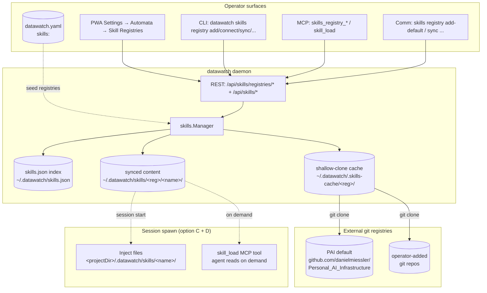

# Skills (BL255, v6.7.0)

A **skill** is a self-contained markdown-and-scripts package that influences how an AI session does its work. Skills come from registries (built-in PAI by default; operator can add others), get sync'd selectively into `~/.datawatch/skills/`, and resolve at session spawn either as files in the working directory or via the `skill_load` MCP tool.

## Why skills

- **Reuse a body of practice.** Hand-craft a skill once (e.g., "review-go-changes"), commit it to a git repo, every session that spawns with `skills: [review-go-changes]` gets the practice.
- **Share registries across teams.** Operators can point at internal git repos with team-authored skills.
- **PAI compatibility.** danielmiessler/Personal_AI_Infrastructure ships ~45 skill packs in this same shape; datawatch uses PAI's `SKILL.md` + YAML frontmatter format directly, plus 6 datawatch-specific extensions.
- **Survives sessions.** Skills follow the BL219 lifecycle pattern: injected on session start, cleaned up on session end (when `cleanup_artifacts_on_end=true`), `.datawatch/` added to `.gitignore` so the operator's repo isn't polluted.

## Architecture



## Lifecycle

1. **Add a registry.** Either:
   - `datawatch skills registry add-default` (idempotent — adds PAI), or
   - `datawatch skills registry add <name> <git-url>` (your own)
2. **Connect.** Daemon does a `git clone --depth=1` into `~/.datawatch/.skills-cache/<reg>/` and walks the tree for `SKILL.md` files. Each becomes an *available* skill.
3. **Browse.** Inspect what's available before committing disk space. PWA shows a checkbox table; CLI: `datawatch skills registry browse <name>`.
4. **Sync.** Pick the skills you want. The daemon copies each selected skill's directory into `~/.datawatch/skills/<reg>/<name>/`. Only synced skills consume real disk + appear in the resolution path.
5. **Use.** Spawn a session with `Skills: ["my-skill"]` (set on PRD, or directly on `/api/sessions/start`). Daemon copies the skill's files into `<projectDir>/.datawatch/skills/<name>/` and the `skill_load` MCP tool can read them on demand.
6. **Cleanup.** When the session ends and `cleanup_artifacts_on_end=true`, the `<projectDir>/.datawatch/skills/` directory is removed. The synced copy at `~/.datawatch/skills/` stays for reuse.

## Manifest format

Each skill ships a `SKILL.md` (or `skill.md` / `skill.yaml`) with a YAML frontmatter block:

```yaml
---
# PAI base format (compatible with danielmiessler/Personal_AI_Infrastructure)
name: review-go-changes
description: Review staged Go changes for tests, error handling, and AGENT.md compliance.
version: 1.2.0
tags: [code-review, go]
entrypoint: ./run.sh

# datawatch v1 extensions (all six are optional and additive)
compatible_with: [datawatch>=6.7.0]   # (a) compatibility hints
requires: [test-runner-go]             # (b) dependency declarations
applies_to:                            # (c) routing / applicability
  agents: [claude-code, opencode]
  session_types: [coding]
  comm_channels: []                    # empty = any
cost_hint: medium                      # (d) resource hints
disk_mb: 12
verify: ./verify.sh                    # (e) verification command (post-sync)
provides_mcp_tools: [scan_for_test_gaps]  # (f) MCP-tool declarations
---

# Review Go Changes

A walk-through of how to inspect a Go diff for the patterns we care about…
```

The parser is **tolerant of unknown fields** (per the [Skills-Awareness Rule](../AGENT.md#skills-awareness-rule-bl255-v670)): future extensions land in the `Extra` map and round-trip through sync without loss. PWA / CLI surfaces render unknown fields as raw key/value rather than hiding them.

## Resolution at session spawn (options C + D)

When a session spawns with `Skills: ["foo", "bar"]`:

| Option | Behavior | Always-on? |
|---|---|---|
| **C — File injection** | Daemon copies each synced skill's directory into `<projectDir>/.datawatch/skills/<name>/`. Agent process reads the markdown from disk. | Yes for v1 (per BL255 design Q3). |
| **D — `skill_load` MCP tool** | The agent calls `skill_load <name>` over MCP and gets the skill's markdown returned as text. Avoids prompt bloat when many skills are configured but only one is needed. | Yes — the tool is registered unconditionally. |

`.datawatch/` is auto-added to `.gitignore` (and `.cfignore`/`.dockerignore` when present) on session start, mirroring the BL219 backend-artifact hygiene pattern.

## Configuration

YAML — declarative seeding (operator-edited registries persist in `skills.json` and survive YAML edits):

```yaml
skills:
  add_default_on_start: true              # idempotently add PAI on every daemon start
  auto_ignore_on_session_start: true      # default true — adds .datawatch/ to .gitignore
  registries:
    - name: my-team
      kind: git
      url: https://gitea.example.com/team/skills
      branch: main
      auth_secret_ref: ${secret:gitea-skills-token}   # MUST be a secret-ref per Secrets-Store Rule
      description: Internal team skill catalog
      enabled: true
```

## Operator commands (cheat sheet)

| What | Comm channel | CLI | REST |
|---|---|---|---|
| List registries | `skills registry list` | `datawatch skills registry list` | `GET /api/skills/registries` |
| Add a registry | `skills registry add <n> <url>` | `datawatch skills registry add <n> <url>` | `POST /api/skills/registries` |
| Add the PAI default | `skills registry add-default` | `datawatch skills registry add-default` | `POST /api/skills/registries/add-default` |
| Connect to a registry | `skills registry connect <n>` | `datawatch skills registry connect <n>` | `POST /api/skills/registries/{n}/connect` |
| Browse available | `skills registry browse <n>` | `datawatch skills registry browse <n>` | `GET /api/skills/registries/{n}/available` |
| Sync skills | `skills registry sync <n> <a,b\|all>` | `datawatch skills registry sync <n> a b` | `POST /api/skills/registries/{n}/sync` |
| Unsync skills | `skills registry unsync <n> <a,b\|all>` | `datawatch skills registry unsync <n> a b` | `POST /api/skills/registries/{n}/unsync` |
| Delete registry | `skills registry delete <n>` | `datawatch skills registry delete <n>` | `DELETE /api/skills/registries/{n}` |
| List synced | `skills` | `datawatch skills list` | `GET /api/skills` |
| Get one synced | `skills get <name>` | `datawatch skills get <name>` | `GET /api/skills/{name}` |
| Load markdown | `skills load <name>` | `datawatch skills load <name>` | `GET /api/skills/{name}/content` |

PWA surface lives at **Settings → Automata → Skill Registries**.

MCP tools: `skills_registry_list`, `skills_registry_get`, `skills_registry_create`, `skills_registry_update`, `skills_registry_delete`, `skills_registry_add_default`, `skills_registry_connect`, `skills_registry_available`, `skills_registry_sync`, `skills_registry_unsync`, `skills_list`, `skills_get`, `skill_load`.

## Filesystem layout

```
~/.datawatch/
  skills.json                                     ← registry list + synced index
  .skills-cache/                                  ← shallow clones (browse cache)
    pai/                                          ← clone of PAI repo
    my-team/
  skills/                                         ← synced content (the source of truth at resolution time)
    pai/
      summarize-session/
        SKILL.md
        ...
      review-changes/
        SKILL.md
    my-team/
      <name>/
```

Per-session injection lives at `<projectDir>/.datawatch/skills/<name>/` and is removed on session end when `cleanup_artifacts_on_end=true`.

## Walkthrough

See [docs/howto/skills-sync.md](howto/skills-sync.md) for the operator-facing first-time setup walkthrough.
